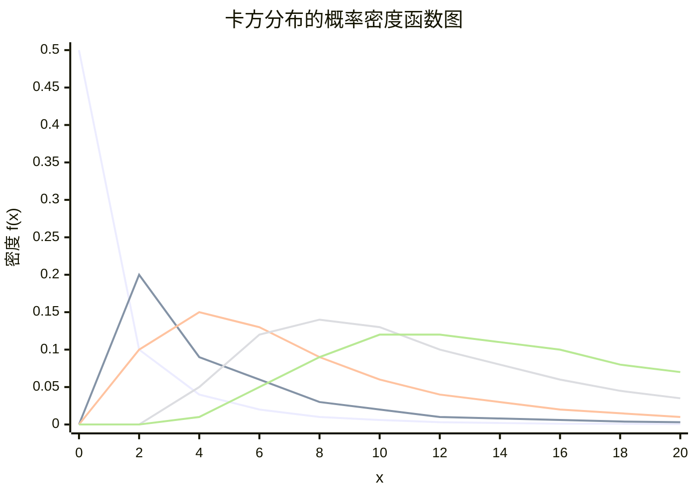
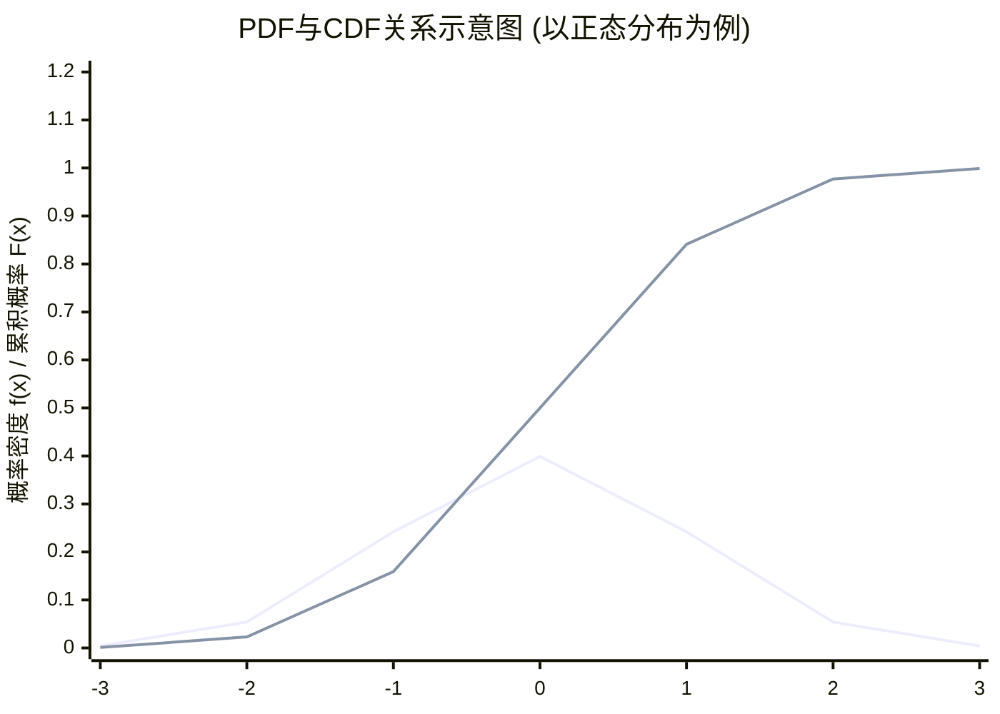
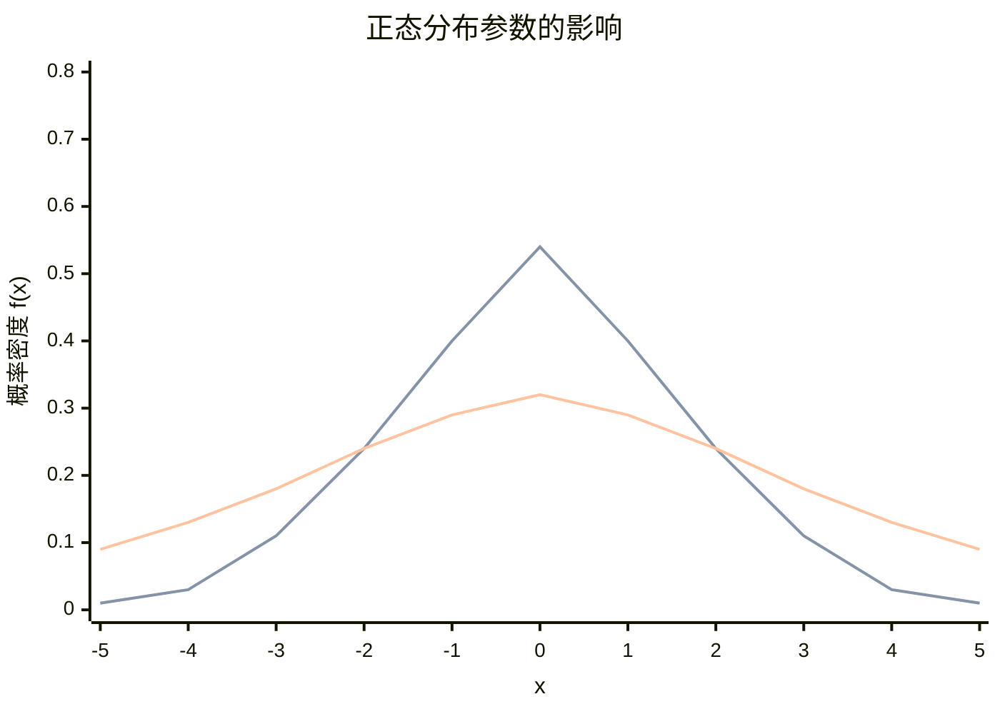
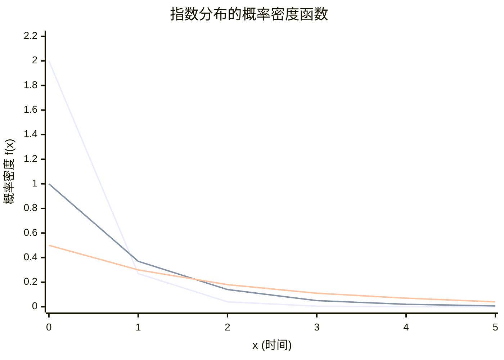
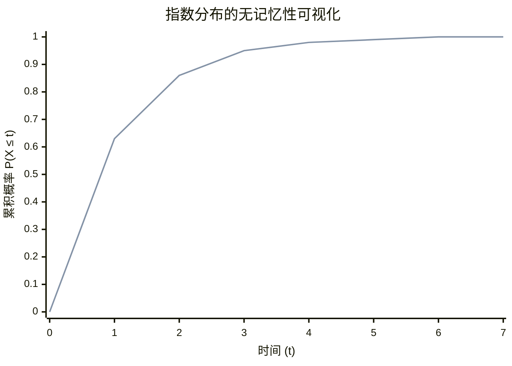
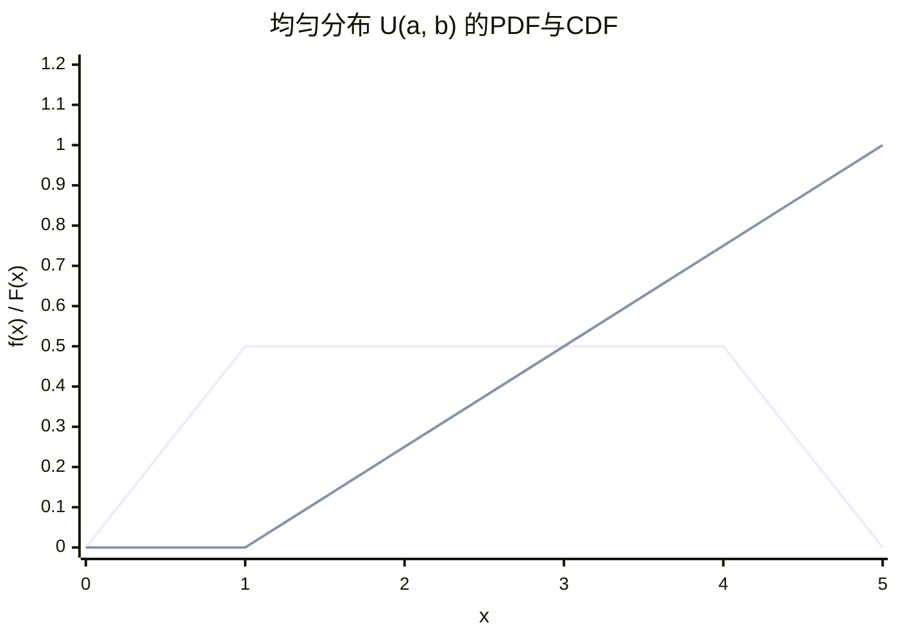
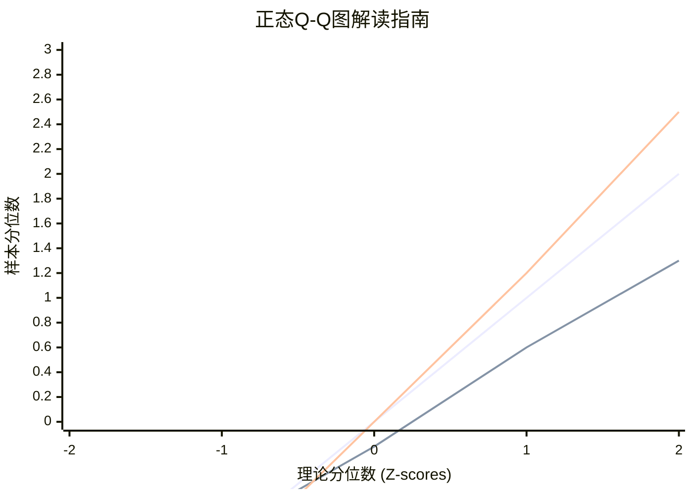

### 2. 累积分布函数

累积分布函数是一个更基础、更统一的概念，因为它对**离散型和连续型**随机变量都适用。

#### 2.1 定义

设 $X$ 是一个随机变量，对任意实数 $x$，累积分布函数 $F_X (x)$ 定义为：
$$ F_X (x) = P (X \le x) $$
即，随机变量 $X$ 的取值**小于等于** $x$ 的概率。

#### 2.2 核心性质

一个函数 $F (x)$ 能成为 CDF，必须满足以下三个性质：

1.  **单调不减性**：如果 $a < b$，则 $F (a) \le F (b)$。
    *   **解释**：随着 $x$ 的增大，“$X \le x$”这个事件包含的可能性越来越多，概率自然不会减小。

2.  **有界性**：
    $$ \lim_{x \to -\infty} F (x) = 0 $$
    $$ \lim_{x \to \infty} F (x) = 1 $$
    *   **解释**：当 $x$ 趋向负无穷时，“$X \le x$”几乎是一个不可能事件，概率为 0。当 $x$ 趋向正无穷时，它几乎是必然事件，概率为 1。

3.  **右连续性**：$\lim_{x \to a^+} F (x) = F (a)$。
    *   **解释**：CDF 的图像从右侧逼近任何一个点时，其值等于该点的函数值。这个性质在连续型随机变量中表现为完全连续，在离散型随机变量中表现为“台阶”的跳跃。

#### 2.3 用途与解读

*   **直接计算概率**：
    *   $P (X \le a) = F (a)$
    *   $P (X > a) = 1 - F (a)$
    *   $P (a < X \le b) = F (b) - F (a)$ **（这是最重要的公式之一）**

*   **可视化理解**：CDF 的图像从左边接近 0 开始，最终上升到 1。它完整地描述了随机变量的概率分布情况。

**示例**：假设某随机变量 $X$ 的 CDF 如下：
$$
F (x) = \begin{cases}
0 & \text{如果 } x < 0 \\
X^2 & \text{如果 } 0 \le x \le 1 \\
1 & \text{如果 } x > 1
\end{cases}
$$
那么，$P (X \le 0.5) = F (0.5) = (0.5)^2 = 0.25$
$P (0.2 < X \le 0.8) = F (0.8) - F (0.2) = (0.8)^2 - (0.2)^2 = 0.64 - 0.04 = 0.6$

---

### 3. 概率密度函数

概率密度函数是专门为**连续型随机变量**定义的概念。

#### 3.1 动机与定义

对于连续随机变量，我们不能像离散变量那样定义一个“概率质量函数”。取而代之的是**概率密度函数**。

如果随机变量 $X$ 的 CDF $F (x)$ 处处可导，那么其 PDF $f (x)$ 定义为 CDF 的导数：
$$ f (x) = \frac{d}{dx} F (x) $$

反过来，CDF 是 PDF 的积分（从负无穷到 $x$）：
$$ F (x) = \int_{-\infty}^{x} f (t) \, dt $$

#### 3.2 核心性质

一个函数 $f (x)$ 能成为 PDF，必须满足以下两个性质：

1.  **非负性**：对所有 $x$，有 $f (x) \ge 0$。
    *   **解释**：概率密度不能为负。

2.  **归一性**：整个区间上的积分为 1。
    $$ \int_{-\infty}^{\infty} f (x) \, dx = 1 $$
    *   **解释**：随机变量取遍所有可能值的总概率为 1。

#### 3.3 关键理解与常见误区

**最重要的一点：PDF 在某点的值 $f (a)$ 不是概率，而是概率的“密度”。**

*   **密度类比**：想象一根质量不均匀的棍子。PDF $f (x)$ 就像这根棍子在 $x$ 点的**线密度**（单位长度的质量）。$f (a)$ 本身不是质量，但 $f (a)$ 越大，表示在 $a$ 点附近单位长度内的质量越大。
*   **概率是面积的体现**：对于连续随机变量，概率由 PDF 曲线下的**面积**给出。
    $$ P (a < X \le b) = \int_{a}^{b} f (x) \, dx = F (b) - F (a) $$
    这个面积代表了随机变量 $X$ 落在区间 $(a, b]$ 内的概率。

*   **单点概率为零**：由于在单点上积分的面积为 0，所以 $P (X = a) = 0$。这意味着对于连续随机变量，$P (a < X \le b) = P (a \le X \le b) = P (a \le X < b) = P (a < X < b)$。区间端点是否包含，不影响概率值。

**示例**：经典的**均匀分布**。假设 $X$ 在区间 [0, 2] 上均匀分布。
*   其 PDF 为：
    $$
    F (x) = \begin{cases}
    \frac{1}{2} & \text{如果 } 0 \le x \le 2 \\
    0 & \text{其他}
    \end{cases}
    $$
    为什么是 $\frac{1}{2}$？因为要满足归一性：区间 [0,2] 的长度是 2，所以高度必须是 $1/2$ 才能让矩形面积 $2 \times \frac{1}{2} = 1$。
*   其 CDF 可以通过积分得到：
    $$
    F (x) = \int_{-\infty}^{x} f (t) dt = \begin{cases}
    0 & \text{如果 } x < 0 \\
    \frac{x}{2} & \text{如果 } 0 \le x \le 2 \\
    1 & \text{如果 } x > 2
    \end{cases}
    $$
    计算 $P (0.5 < X < 1.5)$：
    *   **用 PDF**：$\int_{0.5}^{1.5} \frac{1}{2} dx = \frac{1}{2} \times (1.5 - 0.5) = 0.5$
    *   **用 CDF**：$F (1.5) - F (0.5) = \frac{1.5}{2} - \frac{0.5}{2} = 0.75 - 0.25 = 0.5$

---

### 4. PDF 与 CDF 的关系总结

让我们用一个清晰的表格和图示来总结它们的关系：

| 特征 | 累积分布函数 $F (x)$ | 概率密度函数 $f (x)$ |
| :--- | :--- | :--- |
| **定义** | $P (X \le x)$ | $f (x) = \frac{d}{dx} F (x)$ |
| **适用范围** | 离散和连续随机变量 | **仅限**连续随机变量 |
| **值的含义** | **累积概率** | **概率密度**（非概率） |
| **计算概率** | $P (a < X \le b) = F (b) - F (a)$ | $P (a < X \le b) = \int_a^b f (x) dx$ |
| **图像纵轴** | 概率值 | 密度值 |
| **单点概率** | $P (X=a) = F (a) - \lim_{x \to a^-} F (a)$（在连续情况下为 0） | 恒为 0 |
| **核心性质** | 单调不减，右连续，$F (-\infty)=0$，$F (\infty)=1$ | 非负，$\int_{-\infty}^{\infty} f (x) dx = 1$ |
| **几何意义** | 曲线从 0 上升到 1 | $F (x)$ 是 $f (x)$ 曲线下从 $-\infty$ 到 $x$ 的面积 |

**关系图**：
```
     微分关系
CDF  <--------->  PDF
F(x)              f(x)
 |                  |
 |积分(从-∞到x)     |积分(求面积)
 |                  |
 V                  V
P(X ≤ x)        P(a<X≤b)
(概率)           (概率)
```

---


### 1. 期望值

期望值是概率分布的核心特征数，它描述了随机变量取值的“平均水平”或“中心位置”，可以理解为一次随机试验的平均结果在理论上的期望值。

#### 1.1 定义

*   **离散型随机变量**：
    若随机变量 $X$ 有概率质量函数 $P (X=x_i)$，则其期望值（均值）为：
    $$
    E[X] = \sum_{\text{所有 } i} x_i P (X=x_i)
    $$
    即，所有可能的取值乘以其概率的加权和。

*   **连续型随机变量**：
    若随机变量 $X$ 有概率密度函数 $f (x)$，则其期望值为：
    $$
    E[X] = \int_{-\infty}^{\infty} x f (x) \, dx
    $$
    **理解**：将连续的取值 $x$ 乘以其局部的“概率密度” $f (x)$，然后在整个实数轴上求和（即积分）。这可以看作是离散情况的连续版本。

#### 1.2 性质（线性性质）

期望值具有极其重要的线性性质，无论随机变量是否独立：
1.  $E[aX + b] = aE[X] + b$ （其中 $a, b$ 是常数）
2.  $E[X + Y] = E[X] + E[Y]$
3.  更一般地，$E\left[\sum_{i=1}^n a_i X_i\right] = \sum_{i=1}^n a_i E[X_i]$

**注意**：$E[XY] = E[X]E[Y]$ 仅当 $X$ 和 $Y$ 相互独立时才成立。

#### 1.3 方差

方差是另一个重要的特征数，它描述了随机变量取值与其期望值的偏离程度，即分布的“离散程度”。

*   **定义**：$\text{Var}(X) = E[(X - E[X])^2]$
*   **计算公式**（更常用）：$\text{Var}(X) = E[X^2] - (E[X])^2$
*   **性质**：
    *   $\text{Var}(aX + b) = a^2 \text{Var}(X)$ （常数 $b$ 不影响离散程度）
    *   如果 $X$ 和 $Y$ 独立，则 $\text{Var}(X + Y) = \text{Var}(X) + \text{Var}(Y)$
*   **标准差**：$\sigma (X) = \sqrt{\text{Var}(X)}$，与 $X$ 有相同的量纲，更便于解释。

---

### 2. 正态分布

正态分布（又称高斯分布）是统计学中最重要的分布，没有之一。它描述了自然界中大量随机现象，如测量误差、人群的身高、考试成绩等。

#### 2.1 定义与参数

如果连续随机变量 $X$ 的概率密度函数为：
$$
F (x) = \frac{1}{\sigma\sqrt{2\pi}} e^{-\frac{(x-\mu)^2}{2\sigma^2}}
$$
则称 $X$ 服从参数为 $\mu$（均值）和 $\sigma^2$（方差）的正态分布，记为 $X \sim N (\mu, \sigma^2)$。

*   **参数意义**：
    *   $\mu$：**位置参数**。决定了分布的中心位置。PDF 图像关于 $x = \mu$ 对称。
    *   $\sigma$：**尺度参数**。决定了分布的扁平程度。$\sigma$ 越大，曲线越扁平，数据越分散。

#### 2.2 性质与特点

1.  **钟形曲线**：PDF 呈对称的钟形。
2.  **数字特征**：
    *   期望值 $E[X] = \mu$
    *   方差 $\text{Var}(X) = \sigma^2$
3.  **“3σ”法则（经验法则）**：
    *   $P (\mu - \sigma < X < \mu + \sigma) \approx 0.6827$
    *   $P (\mu - 2\sigma < X < \mu + 2\sigma) \approx 0.9545$
    *   $P (\mu - 3\sigma < X < \mu + 3\sigma) \approx 0.9973$
    这意味着绝大部分（99.73%）的值都落在均值左右 3 个标准差的范围内。

#### 2.3 标准正态分布

当 $\mu = 0$，$\sigma = 1$ 时的正态分布称为**标准正态分布**，记为 $Z \sim N (0, 1)$。
*   其 PDF 通常记为 $\phi (z) = \frac{1}{\sqrt{2\pi}} e^{-z^2/2}$
*   其 CDF 通常记为 $\Phi (z) = P (Z \le z)$

**标准化（Z 变换）**：任何正态分布都可以通过线性变换转化为标准正态分布。
$$
\text{如果 } X \sim N (\mu, \sigma^2), \text{ 则 } Z = \frac{X - \mu}{\sigma} \sim N (0, 1)
$$
这个性质至关重要，因为它允许我们使用标准正态分布表来计算任何正态分布的概率。
*   **计算示例**：求 $P (X \le a)$，其中 $X \sim N (\mu, \sigma^2)$。
    $$
    P (X \le a) = P\left ( \frac{X - \mu}{\sigma} \le \frac{a - \mu}{\sigma} \right) = P\left ( Z \le \frac{a - \mu}{\sigma} \right) = \Phi\left ( \frac{a - \mu}{\sigma} \right)
    $$

#### 2.4 中心极限定理

这是正态分布如此重要的根本原因。
**定理**：设 $X_1, X_2, ..., X_n$ 是独立同分布的随机变量，具有有限的期望值 $\mu$ 和方差 $\sigma^2$。则当 $n$ 足够大时，它们的样本均值 $\bar{X} = \frac{1}{n}\sum_{i=1}^n X_i$ 的分布近似服从正态分布 $N (\mu, \sigma^2/n)$。

**意义**：无论原始数据是什么分布，只要样本量足够大，样本均值的分布就会趋向于正态分布。这使得正态分布在统计推断（如参数估计、假设检验）中扮演了核心角色。

---

### 3. 指数分布与伽马分布

这两种分布在描述“等待时间”或“寿命”等问题中非常常见。

#### 3.1 指数分布

指数分布是伽马分布的一个特例，它描述了**泊松过程中事件间隔时间**的分布。例如，客服电话的接入间隔、机器的无故障运行时间、网页的请求间隔等。

*   **定义**：若 $X$ 的 PDF 为：
    $$
    F (x) = \begin{cases}
    \lambda e^{-\lambda x} & \text{如果 } x \ge 0 \\
    0 & \text{如果 } x < 0
    \end{cases}
    $$
    则称 $X$ 服从参数为 $\lambda$（率参数）的指数分布，记为 $X \sim \text{Exp}(\lambda)$。$\lambda > 0$。

*   **CDF**：
    $$
    F (x) = P (X \le x) = \begin{cases}
    1 - e^{-\lambda x} & \text{如果 } x \ge 0 \\
    0 & \text{如果 } x < 0
    \end{cases}
    $$

*   **数字特征**：
    *   期望值 $E[X] = \frac{1}{\lambda}$ （平均等待时间）
    *   方差 $\text{Var}(X) = \frac{1}{\lambda^2}$

*   **无记忆性**：这是指数分布最独特的性质。
    $$
    P (X > s + t \mid X > s) = P (X > t) \quad \text{对于所有 } s, t \ge 0
    $$
    **解释**：一个元件已经正常运行了时间 $s$，那么它再继续正常运行时间 $t$ 的概率，与一个全新的元件运行时间 $t$ 的概率相同。也就是说，它“忘记”了自己已经使用过的时间。只有指数分布具有这种性质。

#### 3.2 伽马分布

伽马分布是指数分布的推广。指数分布描述了直到**第一次**事件发生所需的时间，而伽马分布描述了直到**第 $\alpha$** 次事件发生所需的时间。

*   **定义**：若 $X$ 的 PDF 为：
    $$
    F (x) = \begin{cases}
    \frac{\lambda^{\alpha}}{\Gamma (\alpha)} x^{\alpha - 1} e^{-\lambda x} & \text{如果 } x > 0 \\
    0 & \text{如果 } x \le 0
    \end{cases}
    $$
    则称 $X$ 服从参数为 $\alpha$（形状参数）和 $\lambda$（率参数）的伽马分布，记为 $X \sim \text{Gamma}(\alpha, \lambda)$。$\alpha>0, \lambda>0$。

*   **伽马函数**：$\Gamma (\alpha) = \int_0^{\infty} t^{\alpha-1} e^{-t} dt$。
    *   当 $\alpha$ 为正整数 $n$ 时，$\Gamma (n) = (n-1)!$。这使得伽马分布与整数次事件联系起来。

*   **数字特征**：
    *   期望值 $E[X] = \frac{\alpha}{\lambda}$
    *   方差 $\text{Var}(X) = \frac{\alpha}{\lambda^2}$

*   **与指数分布和卡方分布的关系**：
    1.  **与指数分布**：当形状参数 $\alpha = 1$ 时，伽马分布退化为指数分布：$\text{Gamma}(1, \lambda) = \text{Exp}(\lambda)$。
    2.  **与卡方分布**：卡方分布是伽马分布的一个特例。当 $\alpha = \frac{\nu}{2}$（$\nu$ 为自由度），$\lambda = \frac{1}{2}$ 时，$\text{Gamma}(\frac{\nu}{2}, \frac{1}{2})$ 就是自由度为 $\nu$ 的卡方分布 $\chi^2 (\nu)$。卡方分布在统计推断中极为重要。

*   **可加性**：如果 $X_1, ..., X_n$ 相互独立，且 $X_i \sim \text{Gamma}(\alpha_i, \lambda)$，则：
    $$
    \sum_{i=1}^n X_i \sim \text{Gamma}\left ( \sum_{i=1}^n \alpha_i, \lambda \right)
    $$
    **特例**：$n$ 个独立同分布的 $\text{Exp}(\lambda)$ 随机变量之和服从 $\text{Gamma}(n, \lambda)$。这从“等待时间”的角度直观地印证了这一点。

### 总结

| 概念 | 核心思想 | 关键参数与公式 | 主要应用 |
| :--- | :--- | :--- | :--- |
| **期望值** | 随机变量的加权平均值，中心位置。 | $E[X] = \int x f (x) dx$ | 描述分布的中心。 |
| **正态分布** | 钟形对称分布，由 CLT 知其普遍性。 | $N (\mu, \sigma^2)$, $Z = \frac{X-\mu}{\sigma}$ | 自然与社会现象的建模，统计推断的基石。 |
| **指数分布** | 描述泊松过程中事件间的等待时间，具有无记忆性。 | $\text{Exp}(\lambda)$, $f (x)=\lambda e^{-\lambda x}$ | 寿命、服务时间、排队论。 |
| **伽马分布** | 指数分布的推广，描述直到第α次事件的等待时间。 | $\text{Gamma}(\alpha, \lambda)$ | 累计等待时间、贝叶斯统计中的共轭先验。 |

---

### 1. 卡方分布的定义与直观理解

#### 1.1 标准定义

卡方分布是一种特殊的**伽马分布**。如果 $k$ 个相互独立的**标准正态**随机变量 $Z_1, Z_2, ..., Z_k$（即 $Z_i \sim N (0,1)$），则这些变量的平方和所服从的分布就是**自由度为 $k$** 的卡方分布。

数学定义：
$$
Q = \sum_{i=1}^k Z_i^2
$$
则 $Q$ 服从自由度为 $k$ 的卡方分布，记为：
$$
Q \sim \chi^2 (k)
$$

*   **自由度**：这里的 $k$ 就是自由度。它可以直观地理解为“独立的平方项的个数”或“信息中‘自由’变动的部分的数量”。

#### 1.2 直观理解

想象一下：
1.  **一个变量** ($k=1$)：$Q = Z_1^2$。由于 $Z_1$ 可正可负，但平方后总是正的。所以 $Q$ 衡量了 $Z_1$ 偏离其均值（0）的**幅度**（不分正负）。大部分时候 $Z_1$ 接近 0，所以 $Q$ 也接近 0，概率最大；当 $Z_1$ 远离 0 时，$Q$ 很大，但概率很小。
2.  **多个变量** ($k>1$)：$Q = Z_1^2 + Z_2^2 + ... + Z_k^2$。这可以看作是衡量一个 $k$ 维点 $(Z_1, Z_2, ..., Z_k)$ 到原点（0,0,..., 0）的**欧氏距离的平方**。这个距离平方越大，说明这个点整体上偏离原点越远。

所以，**卡方分布本质上是衡量一组独立的标准正态随机变量整体“偏离”零点的程度**。

---

### 2. 概率密度函数与性质

#### 2.1 概率密度函数

卡方分布是伽马分布的特例，其 PDF 为：
$$
F (x; k) = \begin{cases}
\frac{1}{2^{k/2}\Gamma (k/2)} x^{k/2 - 1} e^{-x/2}, & \text{如果 } x > 0 \\
0, & \text{如果 } x \le 0
\end{cases}
$$
其中，$\Gamma (\cdot)$ 是伽马函数。当自由度 $k$ 为正整数时，$\Gamma (k/2)$ 有具体的表达式。

#### 2.2 数字特征

*   **期望值**：$E[\chi^2 (k)] = k$
*   **方差**：$\text{Var}(\chi^2 (k)) = 2 k$
*   **众数**：当 $k \ge 2$ 时，众数为 $k - 2$。

#### 2.3 分布形状

卡方分布的形态由其自由度 $k$ 决定：
*   **当 $k=1$ 或 $k=2$**：分布高度右偏。$k=1$ 时从原点开始，单调递减；$k=2$ 时是指数分布。
*   **当 $k$ 增大**：分布逐渐变得对称，形状越来越像正态分布。
*   **当 $k \to \infty$**：由中心极限定理，卡方分布收敛于正态分布 $N (k, 2 k)$。

下图清晰地展示了不同自由度下卡方分布 PDF 形态的变化：


---

### 3. 可加性

卡方分布具有非常好的可加性，这与它来源于平方和有关。

**定理**：如果 $U \sim \chi^2 (k_1)$ 和 $V \sim \chi^2 (k_2)$ 且相互独立，则它们的和也服从卡方分布，自由度为两者之和：
$$
U + V \sim \chi^2 (k_1 + k_2)
$$

这个性质在推导许多统计量的分布时非常有用。

---

### 4. 卡方分布的主要应用

卡方分布在统计学中有三大核心应用，都与**推断**有关。

#### 4.1 拟合优度检验

**目的**：检验一个样本的分布是否与某种理论分布相符。
**思想**：将数据分成 $k$ 个类别。计算每个类别的**观察频数** $O_i$ 和根据理论分布得到的**期望频数** $E_i$。构造以下统计量：
$$
\chi^2 = \sum_{i=1}^{k} \frac{(O_i - E_i)^2}{E_i}
$$
在原假设（样本服从理论分布）成立的条件下，这个统计量**近似**服从自由度为 $k - 1 - p$ 的卡方分布。其中 $p$ 是从数据中估计的理论分布的参数个数。

**判断**：如果计算出的 $\chi^2$ 值大于卡方分布的临界值，我们就拒绝原假设，认为样本分布与理论分布不符。

#### 4.2 独立性检验

**目的**：检验列联表中的两个分类变量是否独立。
**思想**：与拟合优度检验非常相似。对于一个 $r \times c$ 的列联表：
$$
\chi^2 = \sum_{i=1}^{r} \sum_{j=1}^{c} \frac{(O_{ij} - E_{ij})^2}{E_{ij}}
$$
其中 $O_{ij}$ 是观察频数，$E_{ij}$ 是在“两变量独立”的假设下的期望频数 $E_{ij} = \frac{(第 i 行合计) \times (第 j 列合计)}{样本总数}$。

在原假设（两变量独立）成立的条件下，这个统计量**近似**服从自由度为 $(r-1)(c-1)$ 的卡方分布。

#### 4.3 方差估计与推断（正态总体）

**目的**：对来自正态总体的样本方差进行统计推断（如构造置信区间、假设检验）。

**核心结论**：设 $X_1, X_2, ..., X_n$ 是来自正态分布 $N (\mu, \sigma^2)$ 的一个简单随机样本，样本方差为 $S^2 = \frac{1}{n-1}\sum_{i=1}^n (X_i - \bar{X})^2$。则有：
$$
\frac{(n-1) S^2}{\sigma^2} \sim \chi^2 (n-1)
$$

这个结论非常重要，因为它将样本方差（随机变量）和总体方差（参数）通过卡方分布联系起来。

*   **应用 1：单个正态总体方差的置信区间**
    由 $\frac{(n-1) S^2}{\sigma^2} \sim \chi^2 (n-1)$，我们可以找到两个临界值 $\chi^2_{1-\alpha/2}(n-1)$ 和 $\chi^2_{\alpha/2}(n-1)$，使得：
    $$
    P\left ( \chi^2_{1-\alpha/2}(n-1) \le \frac{(n-1) S^2}{\sigma^2} \le \chi^2_{\alpha/2}(n-1) \right) = 1 - \alpha
    $$
    解出 $\sigma^2$ 即可得到其 $(1-\alpha) 100\%$ 置信区间：
    $$
    \left ( \frac{(n-1) S^2}{\chi^2_{\alpha/2}(n-1)}, \frac{(n-1) S^2}{\chi^2_{1-\alpha/2}(n-1)} \right)
    $$

*   **应用 2：两个正态总体方差比的检验（F 检验的基础）**
    如果有两个独立的正态样本，其样本方差分别为 $S_1^2$ 和 $S_2^2$，根据上述结论有：
    $$
    \frac{(n_1-1) S_1^2}{\sigma_1^2} \sim \chi^2 (n_1-1), \quad \frac{(n_2-1) S_2^2}{\sigma_2^2} \sim \chi^2 (n_2-1)
    $$
    将两个独立的卡方变量分别除以各自的自由度后相除，就构成了**F 统计量**，用于检验两个总体方差是否相等 ($H_0: \sigma_1^2 = \sigma_2^2$)。
    $$
    F = \frac{S_1^2 / \sigma_1^2}{S_2^2 / \sigma_2^2} = \frac{S_1^2 / S_2^2}{\sigma_1^2 / \sigma_2^2} \overset{H_0}{\sim} F (n_1-1, n_2-1)
    $$

### 总结

| 方面 | 卡方分布 $\chi^2 (k)$ |
| :--- | :--- |
| **来源** | $k$ 个独立标准正态随机变量的平方和。 |
| **参数** | 自由度 $k$（正整数）。 |
| **PDF 形态** | 右偏，随 $k$ 增大趋于对称。 |
| **期望与方差** | $E[X] = k$，$\text{Var}(X) = 2 k$。 |
| **核心应用** | 1. **拟合优度检验**：检验数据分布是否符合预期。<br>2. **独立性检验**：检验列联表中变量是否相关。<br>3. **方差推断**：为正态总体方差的置信区间和假设检验提供理论依据。 |
| **与其他分布关系** | 是**伽马分布**的特例 $\text{Gamma}(k/2, 1/2)$。是**F 分布**和**t 分布**的组成部分。 |

卡方分布是连接正态分布与计数数据、方差分析等领域的关键桥梁，是统计学家工具箱中不可或缺的工具。

---
### 图解

### 1. PDF 与 CDF 的关系图

这张图展示了连续随机变量的 PDF 和 CDF 是如何关联的，这是最核心的概念。



**图表解读**：
*   **PDF（蓝色曲线）**：著名的“钟形曲线”。其**某个点的值**代表概率密度。
*   **CDF（红色曲线）**：一条从 0 单调增长至 1 的 S 形曲线。其**某个点的值** $F (a)$ 代表 $X \le a$ 的概率，即 $P (X \le a)$。
*   **关键关系**：
    *   **CDF 是 PDF 的积分（面积）**。图中 $P (X \le 0) = F (0) = 0.5$，正好对应 PDF 曲线下从 $-∞$ 到 $0$ 的**阴影面积**（占总面积的一半）。
    *   **PDF 是 CDF 的导数**。CDF 曲线在某个点处的**斜率**，等于该点在 PDF 曲线上的值。

---

### 2. 正态分布 PDF：参数μ和σ的影响

这张图直观展示了正态分布中均值 (μ) 和标准差 (σ) 两个参数的作用。



**图表解读**：
*   **改变均值 $μ$**：比较 `N(0,1)` 和 `N(1,1)`。整个分布的形状不变，但**中心位置**沿着 x 轴发生了平移。$μ$ 决定了分布的**位置**。
*   **改变标准差 $σ$**：比较 `N(0,1)` 和 `N(0,2)`。分布的中心位置不变，但形状变得**更扁平、更分散**。$σ$ 决定了分布的**离散程度（高矮胖瘦）**。$σ$ 越大，数据越分散，曲线越矮胖。

---

### 3. 指数分布 PDF：参数λ的影响

这张图展示了指数分布中不同速率参数 (λ) 对其形状的影响。



**图表解读**：
*   **共同特点**：所有曲线都从 $y = λ$ 开始，然后随着时间 $x$ 增加而**单调递减**。这反映了“等待时间”越长，其概率密度越低。
*   **λ的影响**：
    *   $λ = 2$（蓝色）：起始值最高，下降最快。表示事件发生速率很快，短时间等待的概率高，长时间等待的概率极低。
    *   $λ = 0.5$（黄色）：起始值最低，下降最慢。表示事件发生速率慢，即使等待较长时间，也有相对较高的概率密度。
*   **均值**：每条曲线对应的平均等待时间是 $1/λ$。例如 $λ=1$ 的分布，其均值在 $x=1$ 处。

---

### 4. 指数分布的无记忆性

这张图通过 CDF 来可视化指数分布独一无二的“无记忆性”特性。



**图表解读**：
*   **两条曲线完全重合**：这直观地证明了无记忆性。
*   **红色曲线（从 0 开始）**：表示一个全新元件在时间 $t$ 内失效的概率 $P (X \le t)$。
*   **黄色曲线（从 s=2 开始）**：表示一个已经正常工作了 $s=2$ 个单位时间的“旧”元件，它在未来 $t$ 时间内失效的**条件概率** $P (X \le s+t | X > s)$。
*   **核心结论**：无论这个元件已经使用了多久（图中的 $s$ 点），它剩余寿命的分布与一个全新元件完全相同。它“忘记”了自己已经被使用过的事实。**两条曲线完全重合**就是这一特性的最强视觉证据。

---

### 1. 均匀分布

均匀分布是所有连续分布中最简单的一种，它描述了一种“等可能性”的场景。

#### 1.1 定义与参数

如果随机变量 $X$ 在区间 \([a, b]\) 上取任何长度的子区间的概率与该子区间的长度成正比，而与具体位置无关，则称 $X$ 服从均匀分布。

*   **概率密度函数**：
    $$
    F (x) = \begin{cases}
    \frac{1}{b - a} & \text{对于 } a \le x \le b \\
    0 & \text{其他}
    \end{cases}
    $$
*   **累积分布函数**：
    $$
    F (x) = \begin{cases}
    0 & \text{对于 } x < a \\
    \frac{x - a}{b - a} & \text{对于 } a \le x \le b \\
    1 & \text{对于 } x > b
    \end{cases}
    $$
*   **记法**：$X \sim U (a, b)$

#### 1.2 数字特征

*   **期望值（均值）**：$E[X] = \frac{a + b}{2}$ （区间的中点）
*   **方差**：$\text{Var}(X) = \frac{(b - a)^2}{12}$
*   **标准差**：$\sigma = \frac{b - a}{\sqrt{12}}$

#### 1.3 直观理解与图表

PDF 是一个在区间 \([a, b]\) 上的常数函数，形成一个完美的矩形。这确保了在任何子区间 \([c, d]\) 内的概率只取决于其长度 $(d-c)$，即 $P (c < X < d) = \frac{d-c}{b-a}$。



**图表解读**：
*   **PDF（蓝色矩形）**：在区间 \([a, b]\) 内，概率密度恒定，为 $\frac{1}{b-a}$。矩形下的总面积为 1。
*   **CDF（红色斜线）**：从点 (a, 0) 到点 (b, 1) 的一条直线，斜率为 $\frac{1}{b-a}$。在任意点 $x$ 的值 $F (x)$ 等于从 $a$ 到 $x$ 的矩形面积，直观反映了“累积”的过程。

#### 1.4 应用

*   **随机数生成**：是计算机生成伪随机数的基础，其他复杂分布的随机数常通过均匀分布变换得到。
*   **四舍五入误差**：对一个数进行四舍五入，其误差通常建模为均匀分布。
*   **贝叶斯统计**：在缺乏先验信息时，常用均匀分布作为无信息先验。

---

### 2. 其他连续分布

除了正态、指数、伽马和均匀分布，还有几个非常重要的连续分布。

#### 2.1 贝塔分布

贝塔分布是定义在区间 \([0, 1]\) 上的一个非常灵活的分布，由两个形状参数 $\alpha$ 和 $\beta$ 控制。

*   **PDF**：$f (x; \alpha, \beta) = \frac{x^{\alpha-1}(1-x)^{\beta-1}}{B (\alpha, \beta)}$，其中 $B (\alpha, \beta)$ 是贝塔函数。
*   **应用**：
    *   **建模比例或概率**：例如，一个事件的成功概率的不确定性。
    *   **贝叶斯统计**：作为二项分布的共轭先验。
*   **形状灵活性**：
    *   $\alpha = \beta = 1$：退化为 $U (0,1)$。
    *   $\alpha, \beta > 1$：单峰，集中在均值附近。
    *   $\alpha, \beta < 1$：U 形。
    *   $\alpha > \beta$：左偏。
    *   $\alpha < \beta$：右偏。

#### 2.2 威布尔分布

威布尔分布是可靠性工程和失效分析中最重要的分布之一，它是指数分布的推广。

*   **PDF**：$f (x; \lambda, k) = \frac{k}{\lambda} \left ( \frac{x}{\lambda} \right)^{k-1} e^{-(x/\lambda)^k} \quad \text{for } x \ge 0$
*   **参数**：
    *   $k$（形状参数）：决定分布的形状。
        *   $k = 1$：退化为指数分布 $\text{Exp}(1/\lambda)$。
        *   $k < 1$：失效率随时间递减（早期失效）。
        *   $k > 1$：失效率随时间递增（老化、磨损）。
    *   $\lambda$（尺度参数）：类似于正态分布的 $\sigma$，影响分布的伸展。
*   **应用**：寿命数据分析、风速分布、极值理论。

#### 2.3 对数正态分布

如果一个随机变量的对数服从正态分布，则该变量本身服从对数正态分布。

*   **定义**：如果 $\ln (X) \sim N (\mu, \sigma^2)$，则 $X \sim \text{Lognormal}(\mu, \sigma^2)$。
*   **特性**：
    *   取值始终为正 $(x > 0)$。
    *   分布右偏，长尾指向大值方向。
*   **应用**：
    *   金融领域（股票价格、收入分布）。
    *   生物学（生物体的尺寸、浓度）。
    *   维修时间分布。

---

### 3. 概率图

概率图是一种强大的**图形化工具**，用于评估一个数据集是否来自某个特定的理论分布。

#### 3.1 Q-Q 图

最常用的概率图是**分位数-分位数图**，简称 Q-Q 图。

*   **原理**：将样本数据的**经验分位数**与假设的理论分布的**理论分位数**作为散点画在图上。
    *   **经验分位数**：将样本数据排序后，第 $p$ 分位数对应的数据值。
    *   **理论分位数**：假设的分布（如正态分布）的 CDF 的反函数 $F^{-1}(p)$。
*   **解读**：
    *   **如果数据点大致落在一条直线附近** → 说明样本数据很可能来自该理论分布。
    *   **如果数据点系统地偏离直线** → 说明样本数据可能不服从该理论分布。偏离的模式可以揭示分布如何偏离（如右偏、厚尾等）。

#### 3.2 正态 Q-Q 图

这是最常用的 Q-Q 图，用于检验数据是否服从正态分布。



**图表解读**：
*   **蓝色对角线（$y=x$）**：代表完美拟合正态分布。所有点都应落在这条线附近。
*   **红色曲线（右偏分布）**：
    *   曲线**向下弯曲**。
    *   低分位数处，点在参考线**上方**（实际值大于理论值）。
    *   高分位数处，点在参考线**下方**（实际值小于理论值）。
    *   这表明样本数据有一个向右的长尾巴。
*   **绿色曲线（厚尾分布）**：
    *   曲线呈**S 形**。
    *   两端（低分位数和高分位数）的点都在参考线**下方**。
    *   这表明样本数据的尾部比正态分布更厚，即有更多的极端值。

#### 3.3 应用概率图的步骤

1.  **提出问题**：我的数据是否服从分布 $D$（例如，正态分布）？
2.  **绘制图形**：生成针对分布 $D$ 的 Q-Q 图。
3.  **视觉判断**：观察数据点与参考直线的偏离程度。
4.  **得出结论**：
    *   无明显系统性偏离 → 没有证据拒绝“数据来自分布 D”的假设。
    *   存在明显的系统性模式 → 怀疑数据不服从分布 D，并根据模式判断偏离类型。

### 总结

| 概念 | 核心思想 | 关键参数/特征 | 主要应用 |
| :--- | :--- | :--- | :--- |
| **均匀分布** | 最简单分布，区间内等可能。 | $a$（下限），$b$（上限），矩形 PDF。 | 随机数生成，无信息先验，舍入误差。 |
| **贝塔分布** | 定义在[0,1]上的灵活分布。 | $\alpha, \beta$（形状参数），形态多变。 | 建模比例/概率，贝叶斯二项先验。 |
| **威布尔分布** | 指数分布的推广，可建模变化失效率。 | $k$（形状），$\lambda$（尺度），$k$ 决定失效率趋势。 | 可靠性工程，失效分析，寿命数据。 |
| **对数正态分布** | 对数变换后服从正态分布。 | 始终为正，右偏，长尾。 | 金融价格，收入分布，生物计量。 |
| **概率图 (Q-Q 图)** | 图形化检验数据分布假设。 | 比较样本与理论分位数，偏离模式揭示分布差异。 | 分布拟合优度检验，模型验证。 |

