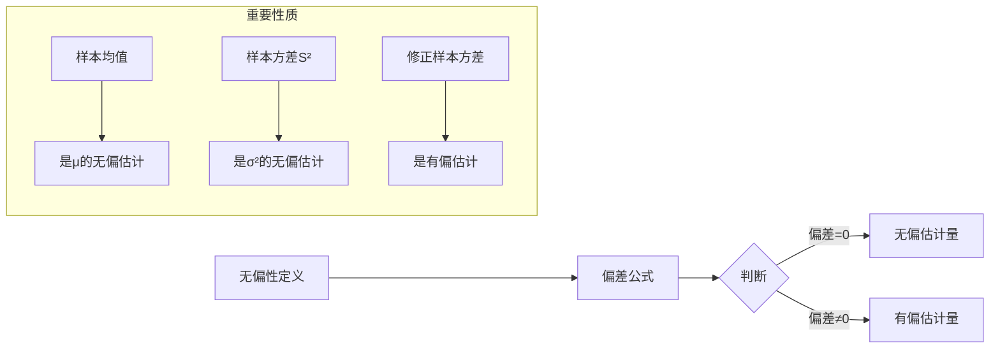
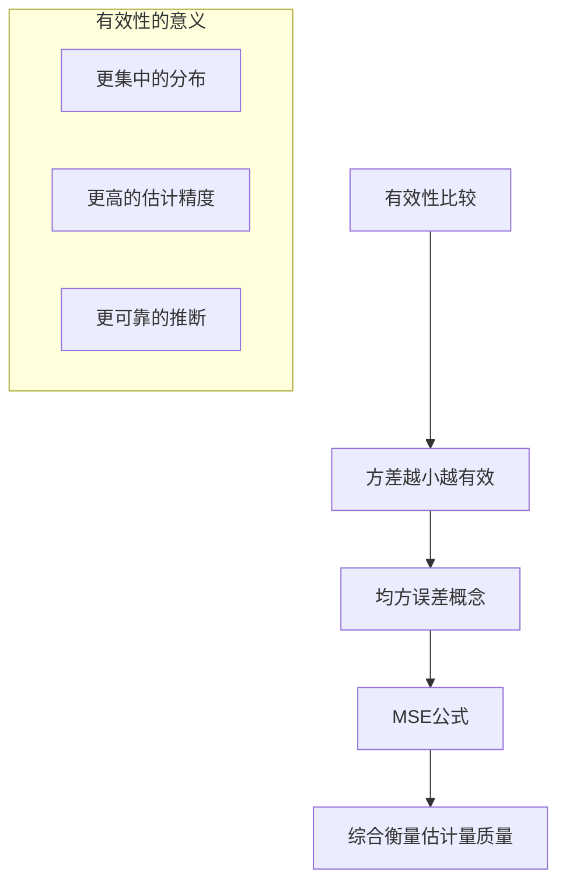
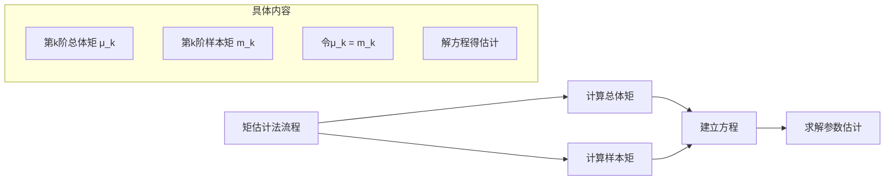
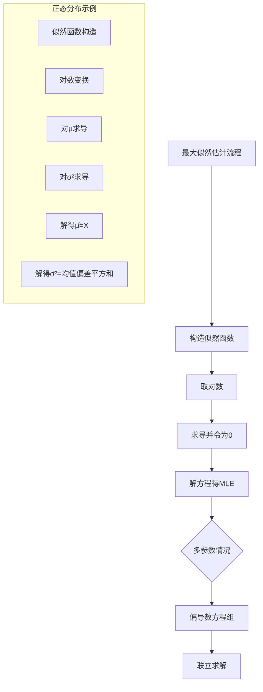
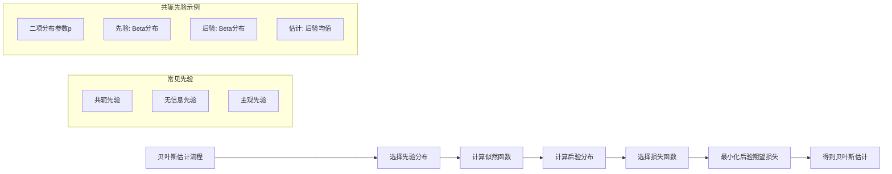
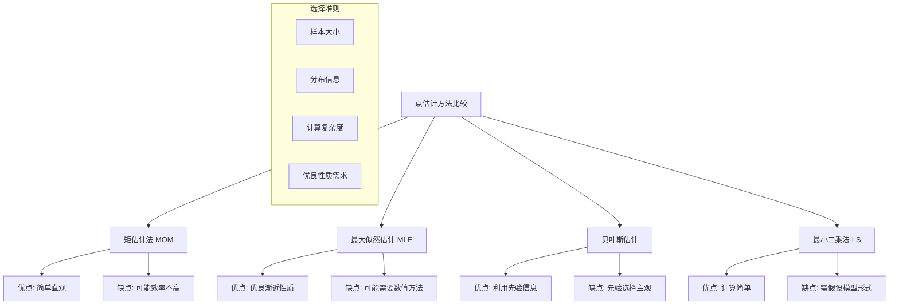

# Point Estimation: 详细系统讲解

## 一、Some General Concepts of Point Estimation

### 1.1 基本概念与定义

**点估计**的核心思想：使用样本数据计算一个**单一数值**作为未知总体参数的估计值。

#### 1.1.1 关键术语
- **参数(Parameter)**：总体分布的特征值（如μ, σ², p）
- **估计量(Estimator)**：用于估计参数的统计量（规则或函数）
- **估计值(Estimate)**：估计量的具体数值结果
- **统计量(Statistic)**：样本的函数，不依赖于未知参数

#### 1.1.2 符号表示
- θ：待估参数（总体参数）
- $\hat{\theta}$：θ的估计量/估计值
- $X_1, X_2, ..., X_n$：随机样本
- $x_1, x_2, ..., x_n$：样本观测值

### 1.2 估计量的评价标准

#### 1.2.1 无偏性(Unbiasedness)

**数学定义**：若 $E(\hat{\theta}) = \theta$，则称 $\hat{\theta}$ 是 θ 的无偏估计。

**重要示例**：
- 样本均值：$\bar{X} = \frac{1}{n}\sum_{i=1}^n X_i$ 是 μ 的无偏估计
- 样本方差：$S^2 = \frac{1}{n-1}\sum_{i=1}^n (X_i - \bar{X})^2$ 是 σ² 的无偏估计
- 注意：$\hat{\sigma}^2 = \frac{1}{n}\sum_{i=1}^n (X_i - \bar{X})^2$ 是有偏估计

#### 1.2.2 有效性(Efficiency)
**相对效率**：对于θ的两个无偏估计量 $\hat{\theta}_1$ 和 $\hat{\theta}_2$，若 $Var(\hat{\theta}_1) < Var(\hat{\theta}_2)$，则称 $\hat{\theta}_1$ 比 $\hat{\theta}_2$ 更有效。

#### 1.2.3 一致性(Consistency)
随着样本容量增加，估计量收敛于真实参数的性质。

**定义**：若 $\forall \epsilon > 0$，$\lim_{n\to\infty} P(|\hat{\theta}_n - \theta| < \epsilon) = 1$，则称 $\hat{\theta}_n$ 是θ的一致估计量。

**充分条件**：
1. $\lim_{n\to\infty} E(\hat{\theta}_n) = \theta$（渐近无偏）
2. $\lim_{n\to\infty} Var(\hat{\theta}_n) = 0$

#### 1.2.4 充分性(Sufficiency)
充分统计量包含了样本中关于参数θ的全部信息。

**因子分解定理**：统计量 $T(X)$ 是θ的充分统计量 ⇔ 联合概率函数可分解为：
$$
f(x_1,...,x_n;\theta) = g(T(x);\theta) \cdot h(x_1,...,x_n)
$$
其中h不依赖于θ。

### 1.3 点估计的分布性质

#### 1.3.1 抽样分布
估计量的概率分布称为其抽样分布。

#### 1.3.2 均方误差(Mean Squared Error)
$$
MSE(\hat{\theta}) = E[(\hat{\theta} - \theta)^2] = Var(\hat{\theta}) + [Bias(\hat{\theta})]^2
$$

## 二、Methods of Point Estimation

### 2.1 矩估计法(Method of Moments, MOM)

#### 2.1.1 基本原理
用样本矩替代相应的总体矩，建立方程求解参数估计。

**步骤**：
1. 计算总体矩（作为参数的函数）
2. 计算对应的样本矩
3. 令总体矩等于样本矩，建立方程组
4. 解方程组得到参数的矩估计

#### 2.1.2 示例：指数分布
设 $X \sim Exp(\lambda)$，$f(x;\lambda) = \lambda e^{-\lambda x}, x>0$
1. 总体一阶矩：$E(X) = 1/\lambda$
2. 样本一阶矩：$\bar{X}$
3. 方程：$1/\lambda = \bar{X}$
4. 解：$\hat{\lambda}_{MM} = 1/\bar{X}$

#### 2.1.3 矩估计的性质
- **优点**：简单易行，不需要知道总体分布的具体形式
- **缺点**：可能不唯一，可能效率不高，可能不合理（如估计值超出参数空间）

### 2.2 最大似然估计法(Maximum Likelihood Estimation, MLE)

#### 2.2.1 基本思想
"最可能产生观测样本的参数值"

**似然函数**：
- 离散情况：$L(\theta; x) = P(X_1=x_1, ..., X_n=x_n; \theta)$
- 连续情况：$L(\theta; x) = f(x_1, ..., x_n; \theta)$

#### 2.2.2 求解步骤
1. 写出似然函数 $L(\theta) = \prod_{i=1}^n f(x_i;\theta)$
2. 取对数得对数似然函数 $l(\theta) = \ln L(\theta)$
3. 对θ求导并令导数为0：$\frac{\partial l(\theta)}{\partial \theta} = 0$
4. 验证二阶导数为负，确保是最大值
5. 解方程得最大似然估计 $\hat{\theta}_{MLE}$

#### 2.2.3 MLE的重要性质
1. **不变性原理**：若 $\hat{\theta}$ 是θ的MLE，则对任意函数g，$g(\hat{\theta})$ 是 $g(\theta)$ 的MLE
2. **渐近性质**：
   - 一致性：$\hat{\theta}_{MLE} \xrightarrow{P} \theta$
   - 渐近正态性：$\sqrt{n}(\hat{\theta}_{MLE} - \theta) \xrightarrow{d} N(0, I^{-1}(\theta))$
   - 渐近有效性：达到Cramér-Rao下界
3. **充分性**：若充分统计量存在，MLE是充分统计量的函数

#### 2.2.4 示例：伯努利分布
设 $X \sim Bernoulli(p)$，观测到 $x_1, ..., x_n$
1. 似然函数：$L(p) = \prod_{i=1}^n p^{x_i}(1-p)^{1-x_i} = p^{\sum x_i}(1-p)^{n-\sum x_i}$
2. 对数似然：$l(p) = (\sum x_i)\ln p + (n-\sum x_i)\ln(1-p)$
3. 求导：$\frac{dl}{dp} = \frac{\sum x_i}{p} - \frac{n-\sum x_i}{1-p} = 0$
4. 解得：$\hat{p}_{MLE} = \frac{1}{n}\sum_{i=1}^n x_i = \bar{x}$

### 2.3 贝叶斯估计法(Bayesian Estimation)

#### 2.3.1 贝叶斯框架
参数θ被视为随机变量，具有先验分布。

**贝叶斯定理**：
$$
\pi(\theta|x) = \frac{f(x|\theta)\pi(\theta)}{\int f(x|\theta)\pi(\theta)d\theta} \propto L(\theta;x)\pi(\theta)
$$
其中：
- $\pi(\theta)$：先验分布
- $L(\theta;x)$：似然函数
- $\pi(\theta|x)$：后验分布

#### 2.3.2 贝叶斯估计量
1. **后验均值**：$\hat{\theta}_{Bayes} = E[\theta|X]$
2. **后验中位数**：使后验分布中位数
3. **后验众数**（MAP估计）：使后验密度最大的θ值

### 2.4 最小二乘估计(Least Squares Estimation)

主要用于回归分析，使残差平方和最小。

**准则**：最小化 $Q(\theta) = \sum_{i=1}^n (y_i - f(x_i;\theta))^2$

### 2.5 各种方法的比较

## 三、估计量的优劣评判体系

### 3.1 Cramér-Rao不等式与有效估计

**Cramér-Rao下界**：在正则条件下，任何无偏估计量 $\hat{\theta}$ 的方差满足：
$$
Var(\hat{\theta}) \geq \frac{1}{nI(\theta)}
$$
其中 $I(\theta) = E\left[\left(\frac{\partial \ln f(X;\theta)}{\partial \theta}\right)^2\right]$ 是Fisher信息量。

**有效估计**：达到Cramér-Rao下界的无偏估计量。

### 3.2 稳健性(Robustness)

估计量对模型假设偏离的敏感性。

### 3.3 模拟比较方法

通过蒙特卡洛模拟比较不同估计量的表现：

1. 从已知分布生成大量样本
2. 对每个样本计算不同估计量
3. 比较偏差、方差、MSE等指标

## 四、应用实例与计算

### 4.1 正态分布参数的估计

设 $X_1,...,X_n \sim N(\mu, \sigma^2)$

**矩估计**：
- $\hat{\mu}_{MM} = \bar{X}$
- $\hat{\sigma}^2_{MM} = \frac{1}{n}\sum_{i=1}^n (X_i - \bar{X})^2$

**最大似然估计**：
- $\hat{\mu}_{MLE} = \bar{X}$
- $\hat{\sigma}^2_{MLE} = \frac{1}{n}\sum_{i=1}^n (X_i - \bar{X})^2$

**比较**：μ的估计相同；σ²的MLE有偏但一致，MM与MLE相同。

### 4.2 均匀分布参数的估计

设 $X_1,...,X_n \sim U(0, \theta)$

**矩估计**：$\hat{\theta}_{MM} = 2\bar{X}$

**最大似然估计**：$\hat{\theta}_{MLE} = X_{(n)} = \max\{X_1,...,X_n\}$

**比较**：MLE明显优于矩估计，因为 $E(\hat{\theta}_{MLE}) = \frac{n}{n+1}\theta$，渐近无偏且方差更小。

## 总结

点估计是统计推断的基础，不同方法各有优劣：

1. **矩估计**：简单直观，适合初步分析
2. **最大似然估计**：理论性质优良，最常用
3. **贝叶斯估计**：融入先验信息，适合小样本
4. **最小二乘**：主要用于回归模型

在实际应用中，应根据具体情况选择合适的估计方法，并考虑估计量的无偏性、有效性、一致性等性质。通常建议报告估计值的同时，也报告其标准误或置信区间，以反映估计的不确定性。