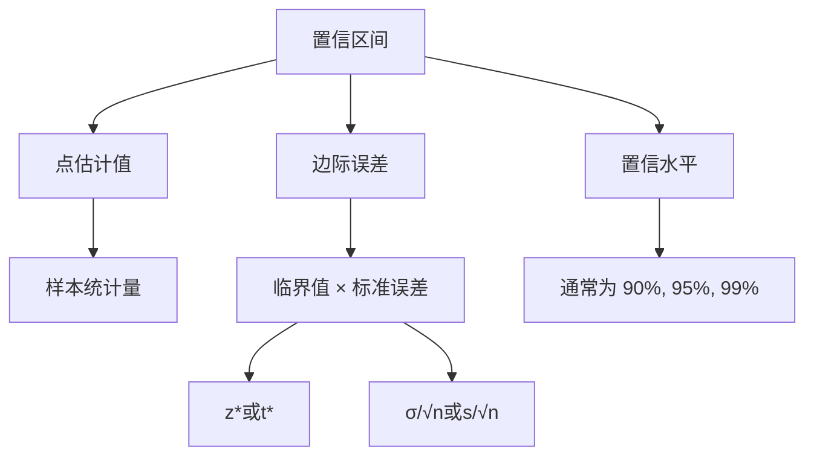
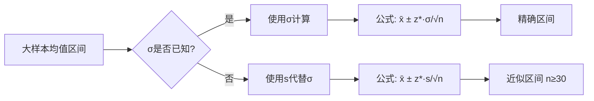
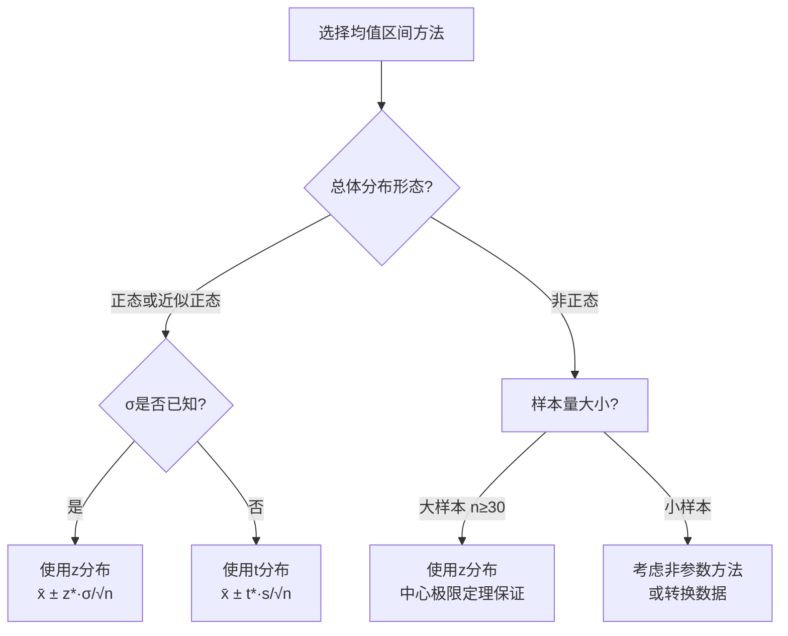
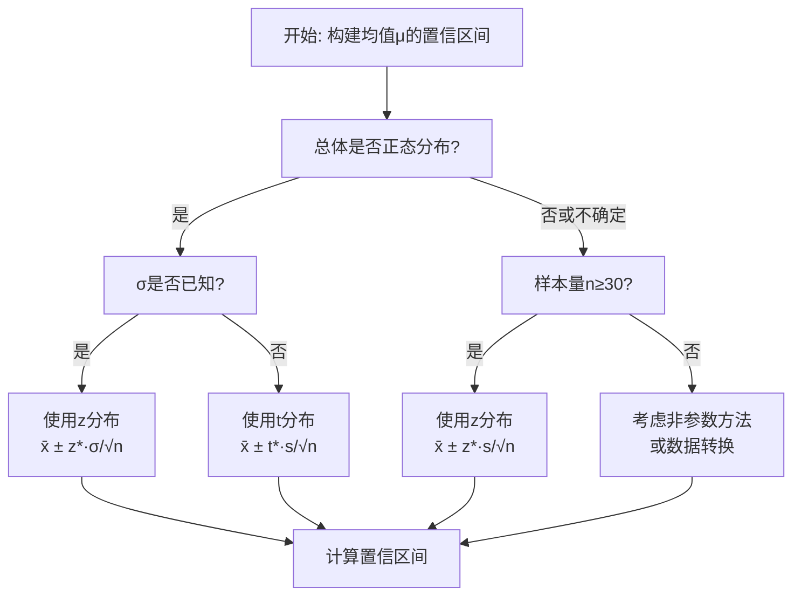

# 统计推断：基于单样本的置信区间

## 1. 置信区间的基本性质 (Basic Properties of Confidence Intervals)

### 1.1 置信区间的定义

**置信区间**是一个随机区间，它以一定的**置信水平(confidence level)** 包含感兴趣的总体参数。如果我们可以重复地从总体中抽取样本，并计算每个样本的置信区间，那么这些区间中会有一定比例包含真实的参数值。

### 1.2 关键要素



### 1.3 置信水平的解释

对于一个95%的置信区间：
- 如果我们重复抽样100次，构建100个置信区间，大约95个会包含真实的总体参数
- **不是**：参数有95%的概率落在该区间内（参数是固定的，区间是随机的）

### 1.4 一般形式

**置信区间的一般公式：**
$$
\text{点估计} \pm (\text{临界值}) \times (\text{标准误差})
$$

其中：
- **点估计**：样本统计量（如样本均值$\bar{x}$，样本比例$\hat{p}$）
- **临界值**：由置信水平和抽样分布决定的值（如$z_{\alpha/2}$, $t_{\alpha/2}$）
- **标准误差**：点估计的标准差估计值

## 2. 大样本总体均值的置信区间 (Large-Sample Confidence Intervals for a Population Mean)

### 2.1 中心极限定理的应用

当样本量$n$足够大时（通常$n \geq 30$），根据中心极限定理，样本均值$\bar{X}$的抽样分布近似正态分布：
$$
\bar{X} \sim N\left(\mu, \frac{\sigma^2}{n}\right) \quad \text{或} \quad \frac{\bar{X} - \mu}{\sigma/\sqrt{n}} \sim N(0,1)
$$

### 2.2 已知总体标准差$\sigma$的情况

**置信区间公式：**
$$
\bar{x} \pm z_{\alpha/2} \cdot \frac{\sigma}{\sqrt{n}}
$$

其中：
- $\bar{x}$：样本均值
- $z_{\alpha/2}$：标准正态分布的临界值
- $\sigma$：总体标准差（已知）
- $n$：样本大小

**常用临界值：**
| 置信水平 | $\alpha$ | $\alpha/2$ | $z_{\alpha/2}$ |
|---------|----------|------------|----------------|
| 90%     | 0.10     | 0.05       | 1.645          |
| 95%     | 0.05     | 0.025      | 1.96           |
| 99%     | 0.01     | 0.005      | 2.576          |

### 2.3 未知总体标准差$\sigma$的情况（大样本）

当$\sigma$未知但$n$足够大时，用样本标准差$s$代替$\sigma$：

**置信区间公式：**
$$
\bar{x} \pm z_{\alpha/2} \cdot \frac{s}{\sqrt{n}}
$$

### 2.4 样本量计算

确定达到指定精度所需的最小样本量：
$$
n = \left( \frac{z_{\alpha/2} \cdot \sigma}{E} \right)^2
$$
其中$E$是希望的边际误差。



## 3. 大样本总体比例的置信区间 (Large-Sample Confidence Intervals for a Population Proportion)

### 3.1 二项分布的正态近似

当$n$足够大，使得$n\hat{p} \geq 10$且$n(1-\hat{p}) \geq 10$时，样本比例$\hat{p}$的抽样分布近似正态：
$$
\hat{p} \sim N\left(p, \frac{p(1-p)}{n}\right)
$$

### 3.2 置信区间公式

**总体比例$p$的置信区间：**
$$
\hat{p} \pm z_{\alpha/2} \cdot \sqrt{\frac{\hat{p}(1-\hat{p})}{n}}
$$

### 3.3 最保守估计与样本量计算

**最保守的样本量估计**（当对$p$没有先验信息时）：
$$
n = \left( \frac{z_{\alpha/2}}{2E} \right)^2 \quad \text{其中取} \hat{p}=0.5
$$

**一般的样本量公式**（当有$\hat{p}$的估计值时）：
$$
n = \left( \frac{z_{\alpha/2}}{E} \right)^2 \cdot \hat{p}(1-\hat{p})
$$

## 4. 基于正态总体分布的置信区间 (Intervals Based on a Normal Population Distribution)

### 4.1 t分布的应用

当总体服从正态分布但$\sigma$未知时，使用t分布：

**标准化统计量：**
$$
T = \frac{\bar{X} - \mu}{S/\sqrt{n}} \sim t_{n-1}
$$
其中$t_{n-1}$表示自由度为$n-1$的t分布。

### 4.2 小样本均值置信区间（正态总体）

**置信区间公式：**
$$
\bar{x} \pm t_{\alpha/2, n-1} \cdot \frac{s}{\sqrt{n}}
$$

其中$t_{\alpha/2, n-1}$是自由度为$n-1$的t分布的临界值。

### 4.3 t分布与正态分布的比较



### 4.4 t分布的特性

1. **对称性**：t分布关于0对称
2. **形状**：比标准正态分布更扁平，尾部更厚
3. **自由度影响**：随着自由度增加，t分布趋近于标准正态分布
4. **临界值**：对于相同的置信水平，$t_{\alpha/2, n-1} > z_{\alpha/2}$

### 4.5 置信区间的宽度与影响因素

**区间宽度** = $2 \times (\text{临界值}) \times (\text{标准误差})$

影响区间宽度的因素：
1. **置信水平**：置信水平越高，区间越宽
2. **样本量**：样本量越大，区间越窄
3. **变异性**：总体变异性越大，区间越宽

## 5. 应用实例与总结

### 5.1 均值置信区间选择流程图



### 5.2 比例置信区间选择

```
如果: n·p̂ ≥ 10 且 n·(1-p̂) ≥ 10
则: 使用 p̂ ± z*·√[p̂(1-p̂)/n]
否则: 考虑精确二项方法或调整公式
```

### 5.3 重要注意事项

1. **独立性假设**：样本观测值必须相互独立
2. **随机性**：样本必须是随机抽取的
3. **正态性检查**：小样本时需要验证正态性假设
4. **异常值影响**：异常值可能严重影响均值的置信区间
5. **解释正确性**：正确理解置信水平的含义

### 5.4 公式总结表

| 参数 | 条件 | 置信区间公式 | 分布 |
|------|------|-------------|------|
| 均值μ | σ已知，任意分布大样本 | $\bar{x} \pm z_{\alpha/2} \cdot \frac{\sigma}{\sqrt{n}}$ | z分布 |
| 均值μ | σ未知，大样本(n≥30) | $\bar{x} \pm z_{\alpha/2} \cdot \frac{s}{\sqrt{n}}$ | z分布 |
| 均值μ | 正态总体，σ未知 | $\bar{x} \pm t_{\alpha/2, n-1} \cdot \frac{s}{\sqrt{n}}$ | t分布 |
| 比例p | 大样本(np̂≥10, n(1-p̂)≥10) | $\hat{p} \pm z_{\alpha/2} \cdot \sqrt{\frac{\hat{p}(1-\hat{p})}{n}}$ | z分布 |

置信区间是统计推断的核心工具，为参数估计提供了精度衡量，在实际应用中需要根据数据特征和条件选择合适的方法。