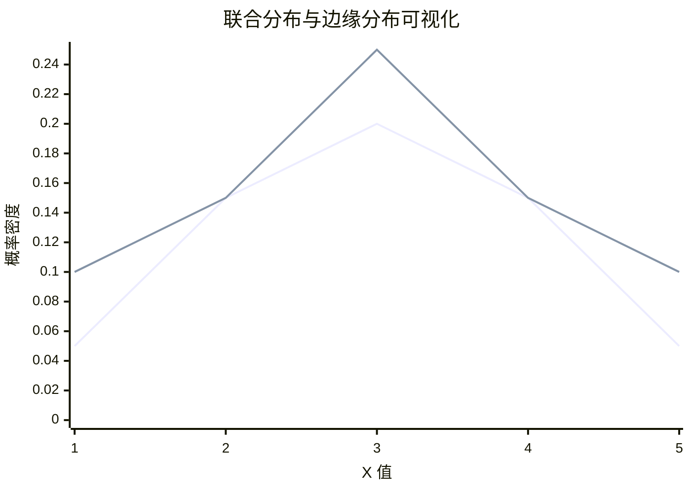
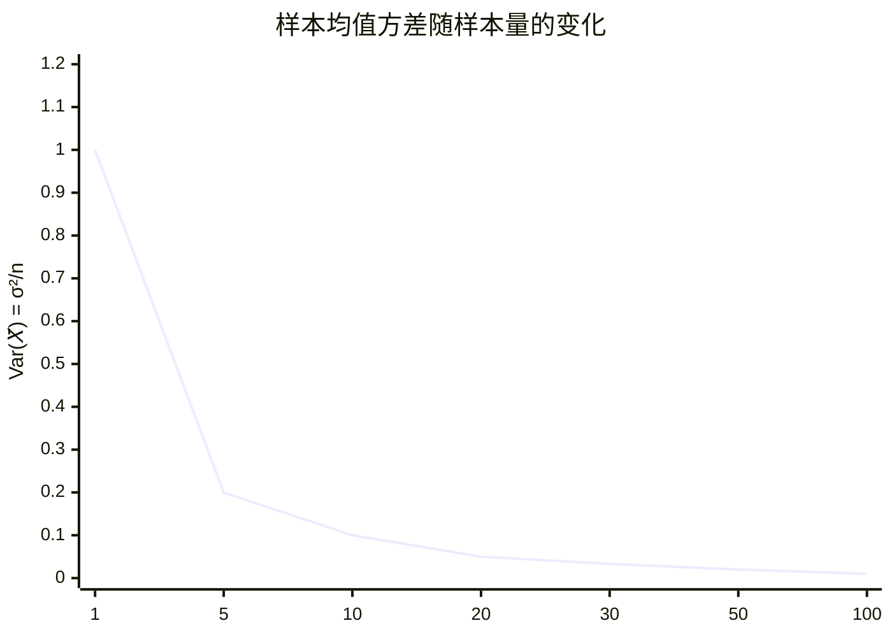
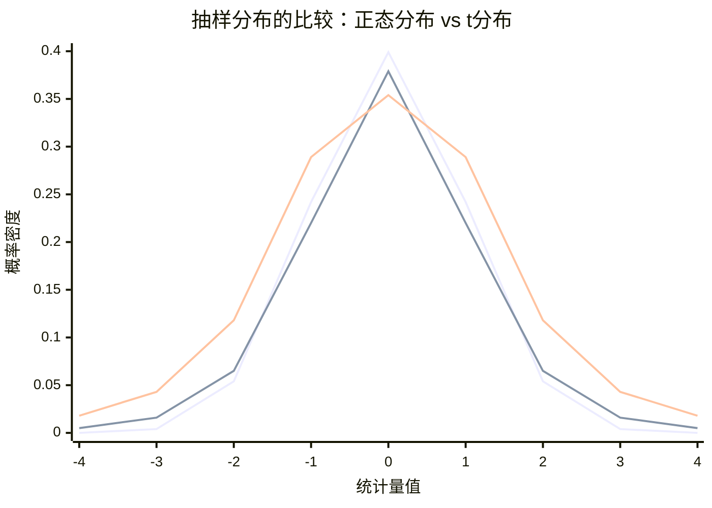
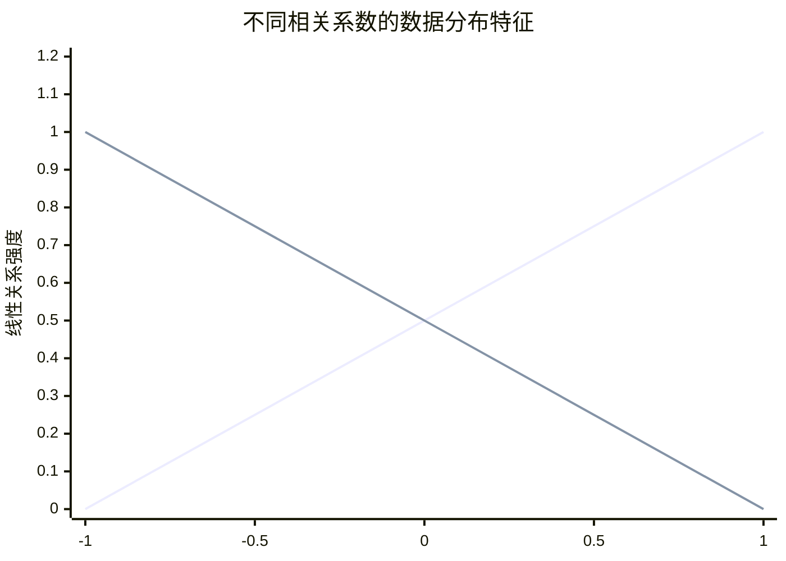
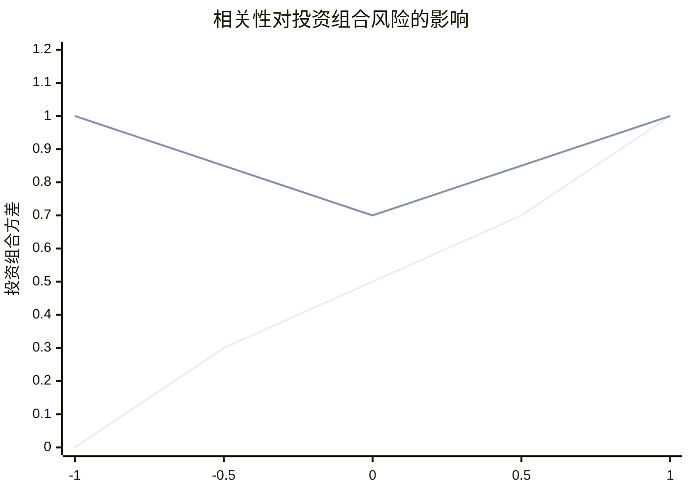

## 1. 联合分布随机变量

在现实世界中，我们经常需要同时研究多个随机变量之间的关系。联合分布就为此提供了数学框架。

### 1.1 联合概率密度函数

对于两个连续随机变量 $X$ 和 $Y$，它们的**联合概率密度函数** $f_{X, Y}(x, y)$ 满足：

1. **非负性**：$f_{X, Y}(x, y) \ge 0$ 对所有 $x, y$
2. **归一性**：$\int_{-\infty}^{\infty} \int_{-\infty}^{\infty} f_{X, Y}(x, y) \, dx \, dy = 1$
3. **概率计算**：$P ((X, Y) \in A) = \iint\limits_A f_{X, Y}(x, y) \, dx \, dy$

### 1.2 边缘分布

从联合分布中可以推导出单个变量的分布，称为**边缘分布**：

- **边缘 PDF**：
  $$
  F_X (x) = \int_{-\infty}^{\infty} f_{X, Y}(x, y) \, dy
  $$
  $$
  F_Y (y) = \int_{-\infty}^{\infty} f_{X, Y}(x, y) \, dx
  $$

### 1.3 条件分布

条件分布描述了一个变量在另一个变量取特定值时的分布：

- **条件 PDF**：
  $$
  F_{Y|X}(y|x) = \frac{f_{X, Y}(x, y)}{f_X (x)} \quad \text{对于 } f_X (x) > 0
  $$

### 1.4 独立性

两个随机变量独立意味着知道一个变量的信息不会影响另一个变量的分布：

- **独立性定义**：$X$ 和 $Y$ 独立当且仅当
  $$
  F_{X, Y}(x, y) = f_X (x) \cdot f_Y (y) \quad \text{对所有 } x, y
  $$



---

## 2. 期望值、协方差和相关性

### 2.1 联合分布的期望值

- **函数的期望**：对于函数 $g (X, Y)$
  $$
  E[g (X, Y)] = \int_{-\infty}^{\infty} \int_{-\infty}^{\infty} g (x, y) f_{X, Y}(x, y) \, dx \, dy
  $$

- **线性性**：$E[aX + bY + c] = aE[X] + bE[Y] + c$

### 2.2 协方差

协方差衡量两个随机变量的**线性相关程度**：

- **定义**：
  $$
  \text{Cov}(X, Y) = E[(X - E[X])(Y - E[Y])]
  $$
- **计算公式**：
  $$
  \text{Cov}(X, Y) = E[XY] - E[X]E[Y]
  $$

**协方差的解读**：
- $\text{Cov}(X, Y) > 0$：正相关（一个变量增大，另一个倾向于增大）
- $\text{Cov}(X, Y) < 0$：负相关（一个变量增大，另一个倾向于减小）
- $\text{Cov}(X, Y) = 0$：不相关（但未必独立！）

### 2.3 相关系数

协方差的数值大小受变量量纲影响，相关系数提供了标准化的度量：

- **Pearson 相关系数**：
  $$
  \rho_{X, Y} = \frac{\text{Cov}(X, Y)}{\sqrt{\text{Var}(X)\text{Var}(Y)}}
  $$

**性质**：
- $-1 \le \rho \le 1$
- $\rho = 1$：完全正相关
- $\rho = -1$：完全负相关
- $\rho = 0$：不相关



### 2.4 重要性质

1. **方差的性质**：
   $$
   \text{Var}(aX + bY) = a^2\text{Var}(X) + b^2\text{Var}(Y) + 2 ab\text{Cov}(X, Y)
   $$

2. **独立性与不相关性**：
   - 如果 $X$ 和 $Y$ 独立，则 $\text{Cov}(X, Y) = 0$
   - 但 $\text{Cov}(X, Y) = 0$ 不一定意味着独立！

---

## 3. 统计量及其分布

### 3.1 统计量的概念

**统计量**是样本的函数，不依赖于任何未知参数。常见的统计量包括：

- **样本均值**：$\bar{X} = \frac{1}{n} \sum_{i=1}^n X_i$
- **样本方差**：$S^2 = \frac{1}{n-1} \sum_{i=1}^n (X_i - \bar{X})^2$
- **样本标准差**：$S = \sqrt{S^2}$

### 3.2 抽样分布

统计量本身也是随机变量，其分布称为**抽样分布**。

#### 3.2.1 样本均值的分布

设 $X_1, X_2, ..., X_n$ 是来自总体 $X$ 的独立同分布样本，$E[X] = \mu$，$\text{Var}(X) = \sigma^2$：

- **期望和方差**：
  $$
  E[\bar{X}] = \mu, \quad \text{Var}(\bar{X}) = \frac{\sigma^2}{n}
  $$

- **中心极限定理**：当 $n$ 足够大时，
  $$
  \bar{X} \stackrel{\text{近似}}{\sim} N\left (\mu, \frac{\sigma^2}{n}\right)
  $$

#### 3.2.2 样本方差的分布

对于正态总体 $X \sim N (\mu, \sigma^2)$：

- **卡方分布关系**：
  $$
  \frac{(n-1) S^2}{\sigma^2} \sim \chi^2 (n-1)
  $$

#### 3.2.3 t 分布

当总体方差未知时，用于小样本的均值推断：

- **定义**：如果 $Z \sim N (0,1)$，$V \sim \chi^2 (\nu)$，且 $Z$ 和 $V$ 独立，则
  $$
  T = \frac{Z}{\sqrt{V/\nu}} \sim t (\nu)
  $$

- **应用**：
  $$
  T = \frac{\bar{X} - \mu}{S/\sqrt{n}} \sim t (n-1)
  $$



### 3.3 F 分布

用于两个方差比的检验：

- **定义**：如果 $U \sim \chi^2 (\nu_1)$，$V \sim \chi^2 (\nu_2)$，且 $U$ 和 $V$ 独立，则
  $$
  F = \frac{U/\nu_1}{V/\nu_2} \sim F (\nu_1, \nu_2)
  $$

- **应用**：方差分析、回归分析

### 3.4 统计推断的应用框架

```python
import numpy as np
import matplotlib.pyplot as plt
import scipy.stats as stats

# 示例：样本均值的抽样分布演示
def demonstrate_sampling_distribution():
    Np.Random.Seed (42)
    
    # 生成总体数据（非正态）
    Population = np.Concatenate ([
        Np.Random.Exponential (2, 5000),
        Np.Random.Normal (10, 1, 5000)
    ])
    
    # 抽样实验
    N_samples = 1000
    Sample_means_n 5 = []
    Sample_means_n 30 = []
    
    For _ in range (n_samples):
        # 样本量 n=5
        Sample 5 = np.Random.Choice (population, size=5, replace=False)
        Sample_means_n 5.Append (np.Mean (sample 5))
        
        # 样本量 n=30  
        Sample 30 = np.Random.Choice (population, size=30, replace=False)
        Sample_means_n 30.Append (np.Mean (sample 30))
    
    # 绘制结果
    Fig, (ax 1, ax 2, ax 3) = plt.Subplots (1, 3, figsize=(15, 5))
    
    # 总体分布
    Ax 1.Hist (population, bins=50, density=True, alpha=0.7)
    Ax 1. Set_title ('总体分布（非正态）')
    Ax 1. Set_xlabel ('值')
    Ax 1. Set_ylabel ('密度')
    
    # 样本量 n=5 的抽样分布
    Ax 2.Hist (sample_means_n 5, bins=50, density=True, alpha=0.7)
    Ax 2. Set_title ('样本均值分布 (n=5)')
    Ax 2. Set_xlabel ('样本均值')
    Ax 2. Set_ylabel ('密度')
    
    # 样本量 n=30 的抽样分布
    Ax 3.Hist (sample_means_n 30, bins=50, density=True, alpha=0.7)
    Ax 3. Set_title ('样本均值分布 (n=30)\n (接近正态)')
    Ax 3. Set_xlabel ('样本均值')
    Ax 3. Set_ylabel ('密度')
    
    Plt. Tight_layout ()
    Plt.Show ()

# Demonstrate_sampling_distribution ()
```

### 总结

| 概念 | 核心思想 | 关键公式/定理 | 主要应用 |
|------|----------|---------------|----------|
| **联合分布** | 描述多个随机变量的共同行为 | $f_{X, Y}(x, y)$, 边缘分布，条件分布 | 多元分析，回归模型 |
| **协方差与相关** | 衡量变量间的线性关系 | $\text{Cov}(X, Y)$, $\rho = \frac{\text{Cov}(X, Y)}{\sigma_X\sigma_Y}$ | 相关性分析，投资组合理论 |
| **统计量** | 样本的概括性度量 | $\bar{X}$, $S^2$, 抽样分布 | 数据描述，探索性分析 |
| **中心极限定理** | 大样本下均值趋于正态 | $\bar{X} \sim N (\mu, \sigma^2/n)$ | 参数估计，假设检验 |
| **t 分布** | 小样本均值推断 | $T = \frac{\bar{X}-\mu}{S/\sqrt{n}} \sim t (n-1)$ | t 检验，置信区间 |
| **F 分布** | 方差比较 | $F = \frac{S_1^2/\sigma_1^2}{S_2^2/\sigma_2^2} \sim F (n_1-1, n_2-1)$ | 方差分析，回归显著性 |

## 1. 样本均值的分布

样本均值的分布是统计学中最重要的概念之一，它连接了描述性统计和推断统计。

### 1.1 基本定义与性质

设 $X_1, X_2, ..., X_n$ 是来自总体 $X$ 的独立同分布随机样本，总体均值为 $\mu$，总体方差为 $\sigma^2$。

**样本均值**定义为：
$$
\bar{X} = \frac{1}{n} \sum_{i=1}^n X_i
$$

#### 1.1.1 期望值与方差

- **期望值**：
  $$
  E[\bar{X}] = E\left[\frac{1}{n} \sum_{i=1}^n X_i\right] = \frac{1}{n} \sum_{i=1}^n E[X_i] = \frac{1}{n} \cdot n\mu = \mu
  $$

- **方差**：
  $$
  \text{Var}(\bar{X}) = \text{Var}\left (\frac{1}{n} \sum_{i=1}^n X_i\right) = \frac{1}{n^2} \sum_{i=1}^n \text{Var}(X_i) = \frac{1}{n^2} \cdot n\sigma^2 = \frac{\sigma^2}{n}
  $$

**关键洞察**：样本均值的方差是总体方差的 $\frac{1}{n}$，这意味着样本量越大，样本均值越稳定。

#### 1.1.2 标准差

样本均值的标准差（标准误差）：
$$
\sigma_{\bar{X}} = \frac{\sigma}{\sqrt{n}}
$$



### 1.2 中心极限定理

这是统计学中最重要的定理，奠定了参数统计推断的基础。

#### 1.2.1 定理陈述

设 $X_1, X_2, ..., X_n$ 是独立同分布随机变量，$E[X_i] = \mu$，$\text{Var}(X_i) = \sigma^2 < \infty$。则当 $n \to \infty$ 时，样本均值的标准化形式收敛于标准正态分布：
$$
\frac{\bar{X} - \mu}{\sigma/\sqrt{n}} \stackrel{d}{\to} N (0, 1)
$$
等价地：
$$
\bar{X} \stackrel{\text{近似}}{\sim} N\left (\mu, \frac{\sigma^2}{n}\right) \quad \text{当 } n \text{ 足够大时}
$$

#### 1.2.2 CLT 的直观演示

```python
import numpy as np
import matplotlib.pyplot as plt
import scipy.stats as stats

def demonstrate_clt():
    np.random.seed(42)
    
    # 从指数分布（强烈右偏）中抽样
    population_mean = 2
    population_std = 2
    
    sample_sizes = [1, 5, 10, 30]
    n_samples = 10000
    
    fig, axes = plt.subplots(2, 2, figsize=(12, 10))
    axes = axes.flatten()
    
    for i, n in enumerate(sample_sizes):
        sample_means = []
        for _ in range(n_samples):
            sample = np.random.exponential(population_mean, n)
            sample_means.append(np.mean(sample))
        
        # 绘制直方图
        axes[i].hist(sample_means, bins=50, density=True, alpha=0.7, 
                    label=f'模拟分布 (n={n})')
        
        # 添加理论正态曲线
        x = np.linspace(0, 6, 100)
        theoretical_mean = population_mean
        theoretical_std = population_std / np.sqrt(n)
        y = stats.norm.pdf(x, theoretical_mean, theoretical_std)
        axes[i].plot(x, y, 'r-', linewidth=2, label='理论正态分布')
        
        axes[i].set_title(f'样本量 n = {n}')
        axes[i].set_xlabel('样本均值')
        axes[i].set_ylabel('密度')
        axes[i].legend()
        axes[i].grid(True, alpha=0.3)
    
    plt.suptitle('中心极限定理演示：从指数分布到正态分布', fontsize=14)
    plt.tight_layout()
    plt.show()

# demonstrate_clt()
```

#### 1.2.3 CLT 的重要性

1. **适用性广泛**：无论总体分布形状如何，只要样本量足够大
2. **样本量要求**：
   - 近似对称分布：n ≥ 15-20
   - 中等偏态分布：n ≥ 20-30  
   - 强烈偏态分布：n ≥ 30-50
3. **实践意义**：允许我们使用正态分布进行各种统计推断

### 1.3 精确分布（正态总体）

当总体服从正态分布时，样本均值有精确的分布：

**定理**：如果 $X_1, X_2, ..., X_n \stackrel{\text{i.i.d.}}{\sim} N (\mu, \sigma^2)$，则
$$
\bar{X} \sim N\left (\mu, \frac{\sigma^2}{n}\right)
$$
$$
\frac{\bar{X} - \mu}{\sigma/\sqrt{n}} \sim N (0, 1)
$$

当总体方差未知时，使用 t 分布：
$$
\frac{\bar{X} - \mu}{S/\sqrt{n}} \sim t (n-1)
$$

---

## 2. 线性组合的分布

线性组合在投资组合理论、回归分析、方差分析等领域有广泛应用。

### 2.1 基本定义

设 $X_1, X_2, ..., X_n$ 是随机变量，$a_1, a_2, ..., a_n$ 是常数，则线性组合定义为：
$$
Y = a_1 X_1 + a_2 X_2 + \cdots + a_nX_n = \sum_{i=1}^n a_iX_i
$$

### 2.2 期望值与方差

#### 2.2.1 期望值（总是成立）
$$
E[Y] = E\left[\sum_{i=1}^n a_iX_i\right] = \sum_{i=1}^n a_iE[X_i]
$$

#### 2.2.2 方差（需要考虑相关性）

- **一般情况**：
  $$
  \text{Var}(Y) = \sum_{i=1}^n a_i^2 \text{Var}(X_i) + 2\sum_{i<j} a_ia_j \text{Cov}(X_i, X_j)
  $$

- **当变量不相关时**（协方差为 0）：
  $$
  \text{Var}(Y) = \sum_{i=1}^n a_i^2 \text{Var}(X_i)
  $$

- **当变量独立时**：
  $$
  \text{Var}(Y) = \sum_{i=1}^n a_i^2 \text{Var}(X_i)
  $$



### 2.3 特殊情况的分布

#### 2.3.1 独立正态变量的线性组合

**定理**：如果 $X_1, X_2, ..., X_n$ 相互独立，且 $X_i \sim N (\mu_i, \sigma_i^2)$，则
$$
Y = \sum_{i=1}^n a_iX_i \sim N\left ( \sum_{i=1}^n a_i\mu_i, \sum_{i=1}^n a_i^2\sigma_i^2 \right)
$$

**推论**：正态分布的线性组合仍然是正态分布。

#### 2.3.2 样本均值作为特例

样本均值是线性组合的特例，其中 $a_i = \frac{1}{n}$：
$$
\bar{X} = \frac{1}{n}X_1 + \frac{1}{n}X_2 + \cdots + \frac{1}{n}X_n
$$
当 $X_i \stackrel{\text{i.i.d.}}{\sim} N (\mu, \sigma^2)$ 时：
$$
\bar{X} \sim N\left (\mu, \frac{\sigma^2}{n}\right)
$$

### 2.4 应用案例：投资组合理论

假设有两个资产：
- 资产 A：期望收益 $\mu_A$，风险 $\sigma_A$
- 资产 B：期望收益 $\mu_B$，风险 $\sigma_B$
- 相关系数：$\rho$

投资组合：投资 $w$ 比例在资产 A，$1-w$ 在资产 B

**组合收益**：$R_p = wR_A + (1-w) R_B$

**组合期望收益**：
$$
E[R_p] = w\mu_A + (1-w)\mu_B
$$

**组合风险**：
$$
\sigma_p^2 = w^2\sigma_A^2 + (1-w)^2\sigma_B^2 + 2 w (1-w)\rho\sigma_A\sigma_B
$$

```python
Import numpy as np
Import matplotlib. Pyplot as plt

Def portfolio_optimization ():
    # 定义两个资产
    Mu_A, sigma_A = 0.08, 0.15    # 资产 A：8%收益，15%风险
    Mu_B, sigma_B = 0.12, 0.25    # 资产 B：12%收益，25%风险
    
    # 不同相关系数
    Correlations = [-0.5, 0, 0.5]
    Weights = np.Linspace (0, 1, 100)  # 从全 B 到全 A
    
    Plt.Figure (figsize=(12, 8))
    
    For rho in correlations:
        Portfolio_returns = []
        Portfolio_risks = []
        
        For w in weights:
            # 组合期望收益
            Exp_return = w * mu_A + (1-w) * mu_B
            
            # 组合风险
            Risk = np.Sqrt (w**2 * sigma_A**2 + 
                          (1-w)**2 * sigma_B**2 + 
                          2*w*(1-w)*rho*sigma_A*sigma_B)
            
            Portfolio_returns.Append (exp_return)
            Portfolio_risks.Append (risk)
        
        Plt.Plot (portfolio_risks, portfolio_returns, 
                Label=f'ρ = {rho}', linewidth=2)
    
    Plt.Xlabel ('组合风险 (标准差)')
    Plt.Ylabel ('组合期望收益')
    Plt.Title ('投资组合有效前沿：相关性对分散化的影响')
    Plt.Legend ()
    Plt.Grid (True, alpha=0.3)
    Plt.Show ()

# Portfolio_optimization ()
```

### 2.5 线性组合的协方差

对于两个线性组合：
$$
U = \sum_{i=1}^n a_iX_i, \quad V = \sum_{j=1}^m b_jY_j
$$
它们的协方差为：
$$
\text{Cov}(U, V) = \sum_{i=1}^n \sum_{j=1}^m a_ib_j \text{Cov}(X_i, Y_j)
$$

---

## 3. 重要定理与推论

### 3.1 独立性与不相关性

- 如果 $X_1, ..., X_n$ 相互独立，则它们两两不相关
- 反之不成立：不相关不一定独立
- 对于正态分布：不相关 ⇔ 独立

### 3.2 大数定律

弱大数定律：当 $n \to \infty$ 时，
$$
\bar{X} \stackrel{P}{\to} \mu
$$
即样本均值依概率收敛于总体均值。

### 3.3 方差的可加性

对于独立随机变量：
$$
\text{Var}(X_1 + X_2 + \cdots + X_n) = \text{Var}(X_1) + \text{Var}(X_2) + \cdots + \text{Var}(X_n)
$$

---

## 总结

| 概念 | 核心内容 | 关键公式 | 应用 |
|------|----------|----------|------|
| **样本均值分布** | 描述样本均值的变异性 | $E[\bar{X}] = \mu$, $\text{Var}(\bar{X}) = \frac{\sigma^2}{n}$ | 参数估计，置信区间 |
| **中心极限定理** | 大样本下均值趋于正态 | $\bar{X} \approx N (\mu, \sigma^2/n)$ | 假设检验，质量控制 |
| **线性组合期望** | 线性组合的均值 | $E[\sum a_iX_i] = \sum a_iE[X_i]$ | 投资组合理论 |
| **线性组合方差** | 考虑相关性的风险度量 | $\text{Var}(\sum a_iX_i) = \sum a_i^2\text{Var}(X_i) + 2\sum_{i<j}a_ia_j\text{Cov}(X_i, X_j)$ | 风险管理，误差传播 |
| **正态线性组合** | 正态变量的线性组合仍为正态 | $\sum a_iN (\mu_i,\sigma_i^2) \sim N (\sum a_i\mu_i, \sum a_i^2\sigma_i^2)$ | 回归分析，实验设计 |
