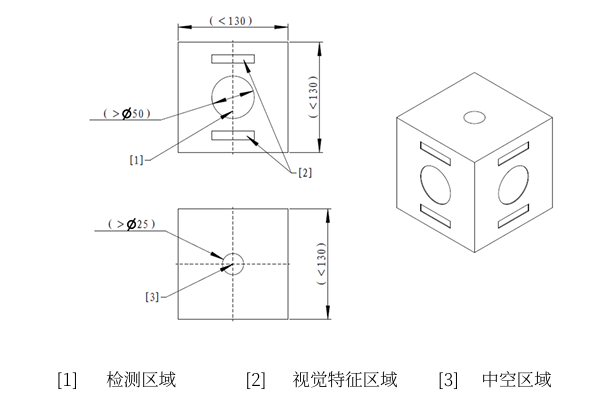

## 雷达激光反制

### 激光检测模块
结构图如下:  

备注：视觉识别方式，或许可以参考装甲板识别(armor_detector)

### 激光装置参数要求

1. 激光发射装置仅可安装在雷达传感器端，且仅允许安装1个。  
2. 激光发射装置的波段不得大于730nm。
   - 建议发光波段范围包含600-700nm。
   - 激光发射装置发射的波需为连续波（CW）。
3. 检录时，激光发射装置需在水平距离5m的竖直墙面上垂直投射，激光光斑包围圆直径≤7.5mm。
   - 建议在水平距离5m的竖直墙面上垂直投射，激光光斑包围圆直径≥5.5mm。
4. 机器人及其他装置可用的激光安全规格如下表所示：  

| 激光安全规格 | Class I | Class II | Class III 及以上 |
| :--- | :--- | :--- | :--- |
| 激光发射装置 | 允许（不建议） | 允许 | 不允许 |
| 其他 | 允许 | 不允许 | 不允许 | 