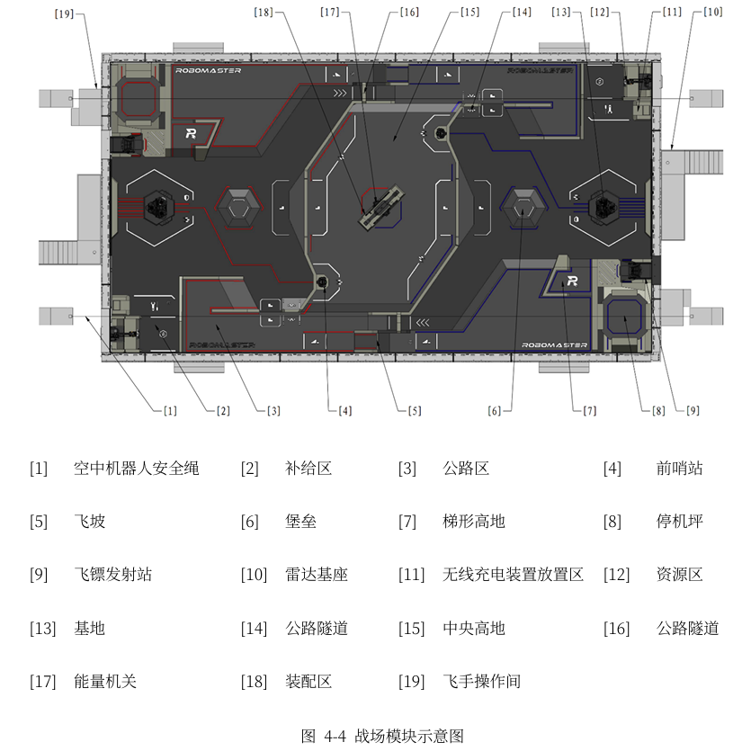
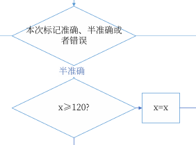
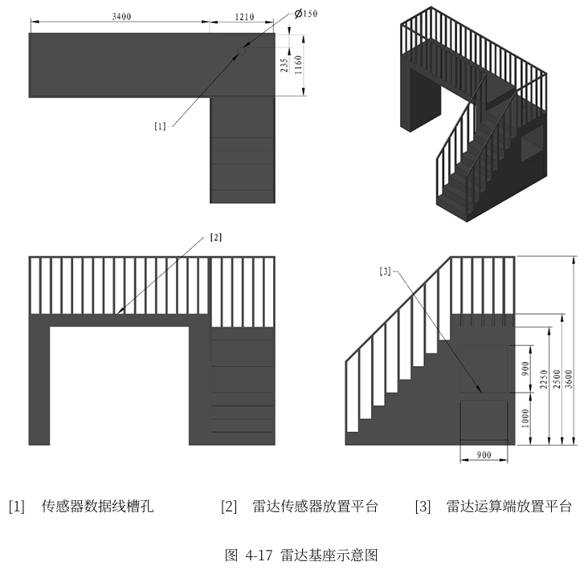
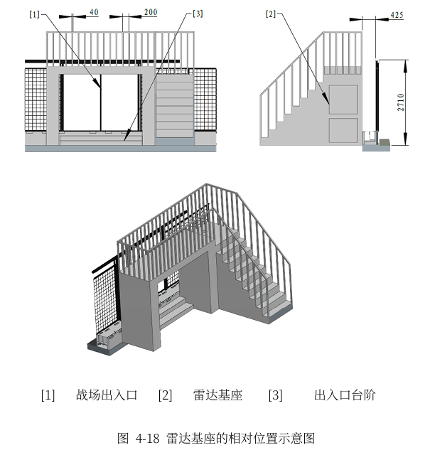

## 26赛季关于雷达部分的改动
### 雷达基座位置调整
修改：
- 放置雷达传感器和激光发射装置
- 上端为面积**3.4m * 1.16m**的平台
- 雷达站基座中央与战场战场**中心轴线对齐**
- 平台**旁边**设有传感器数据线槽孔

战场概述，[10]为雷达

### 调整雷达相关机制（新增反制空中机器人与雷达解析信息波功能） 

雷达的功能包括：雷达识别、雷达反制、雷达解析信息波

修改：
- 新增**雷达反制、雷达解析信息波**
- 修改部分雷达识别进度

##### 雷达识别部分的修改：
当某次标记为半准确时，且当前标记进度 `x>=120` 时，`x=x`，即标记进度不会增加。

##### 雷达反制、雷达解析信息波
完全新增部分。  
雷达解析概括为解析、识别信息波和干扰波，详见“5.6.6雷达特殊机制”  
雷达反制概括为用激光持续照射对方无人机10s，即可完成一次对地方单位的限制。详见5.6.3“空中机器人特殊机制”

### 组委会未来规划
- 提高决策能力
- 有限算力下的高效算法
- **低功耗运行**
- 信息融合

### 雷达基座修改

- 雷达基座

